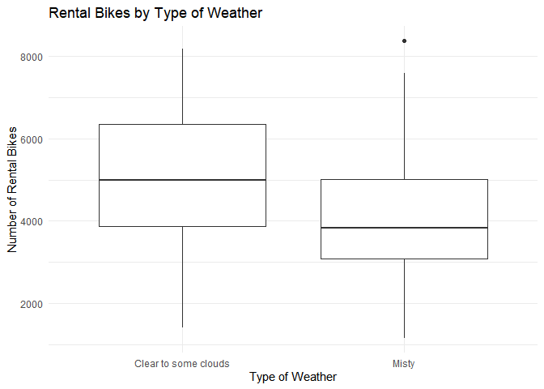
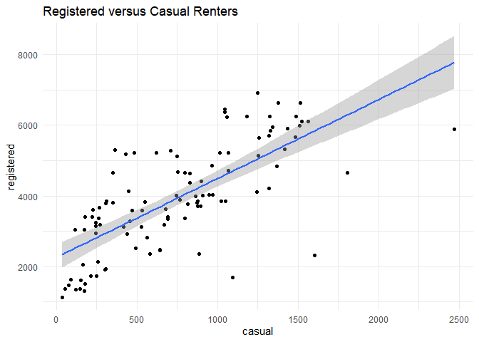
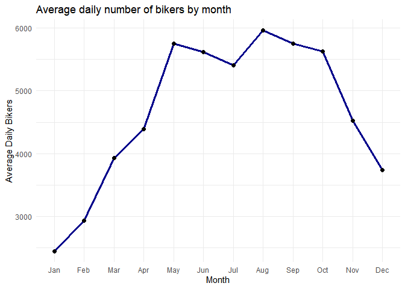
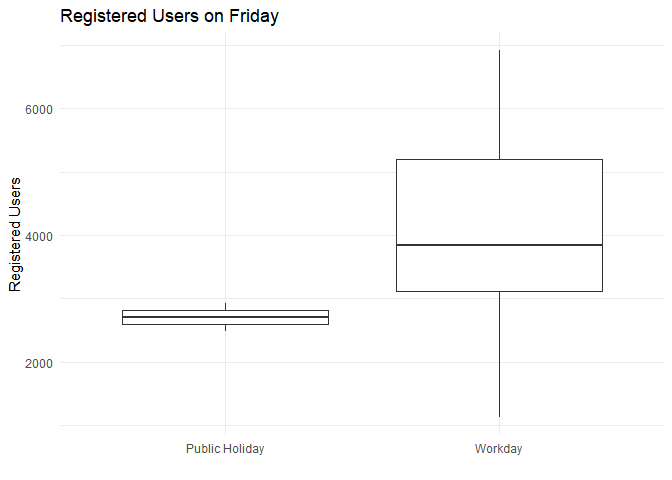
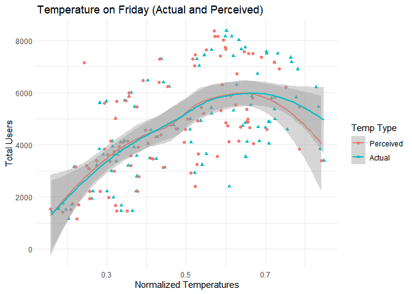
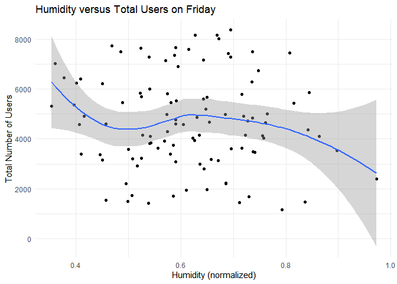
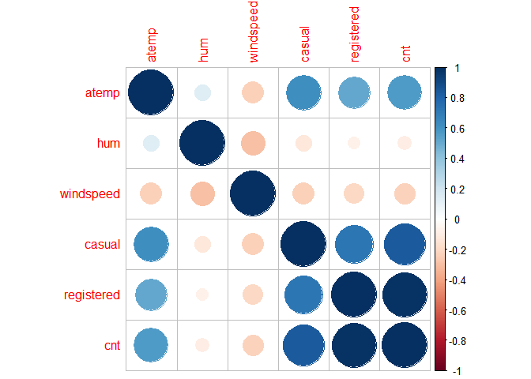

ST558 Project 2
================
Crista Gregg and Halid Kopanski
7/2/2021

-   [Introduction](#introduction)
-   [Data](#data)
-   [Summarizations](#summarizations)
    -   [Summary statistics of users](#summary-statistics-of-users)
    -   [Rentals by Year](#rentals-by-year)
    -   [Types of weather by season](#types-of-weather-by-season)
    -   [Rentals by Weather](#rentals-by-weather)
    -   [Casual vs. Registered bikers](#casual-vs-registered-bikers)
    -   [Average bikers by month](#average-bikers-by-month)
    -   [Holiday and Temperature / Humidity
        data](#holiday-and-temperature--humidity-data)
    -   [Correlation among numeric
        predictors](#correlation-among-numeric-predictors)
-   [Modeling](#modeling)
    -   [Linear Regression](#linear-regression)
        -   [Linear Fit 1](#linear-fit-1)
        -   [Linear Fit 2](#linear-fit-2)
    -   [Ensemble Tree](#ensemble-tree)
        -   [Random Forests](#random-forests)
        -   [Boosting Model](#boosting-model)
-   [Comparison](#comparison)

# Introduction

The following analysis breaks down bicycle sharing usage based on data
gathered for every recorded Friday in the years 2011 and 2012. The data
was gathered from users of Capitol Bikeshare based in Washington DC. In
total, the dataset contains 731 entries. For each entry, 16 variables
were recorded. The following is the list of the 16 variables and a short
description of each:

| Variable   |                                                    Description                                                    |
|------------|:-----------------------------------------------------------------------------------------------------------------:|
| instant    |                                                   record index                                                    |
| dteday     |                                                       date                                                        |
| season     |                                       season (winter, spring, summer, fall)                                       |
| yr         |                                                 year (2011, 2012)                                                 |
| mnth       |                                                 month of the year                                                 |
| holiday    |                                    whether that day is holiday (1) or not (0)                                     |
| weekday    |                                                  day of the week                                                  |
| workingday |                       if day is neither a weekend nor a holiday value is 1, otherwise is 0.                       |
| weathersit |                                   Description of weather conditions (see below)                                   |
| \-         |                                1: Clear, Few clouds, Partly cloudy, Partly cloudy                                 |
| \-         |                          2: Mist + Cloudy, Mist + Broken clouds, Mist + Few clouds, Mist                          |
| \-         |            3: Light Snow, Light Rain + Thunderstorm + Scattered clouds, Light Rain + Scattered clouds             |
| \-         |                           4: Heavy Rain + Ice Pallets + Thunderstorm + Mist, Snow + Fog                           |
| temp       |                                        Normalized temperature in Celsius.                                         |
| atemp      |                                   Normalized perceived temperature in Celsius.                                    |
| hum        |                                               Normalized humidity.                                                |
| windspeed  |                                              Normalized wind speed.                                               |
| casual     |                                               count of casual users                                               |
| registered |                                             count of registered users                                             |
| cnt        |                                      sum of both casual and registered users                                      |
| *Sources*  | *Raw data and more information can be found [here](https://archive.ics.uci.edu/ml/datasets/Bike+Sharing+Dataset)* |

In addition to summary statistics, this report will also model bicycle
users by linear regression, random forests, and boosting. The model will
help determine anticipated number of users based on readily available
data. To achieve this, the response variables are casual, registered,
and cnt. The other variables, not including the date and instant
columns, will be the predictors for models developed later in this
report.

# Data

Here, we set up the data for the selected day of week and convert
categorical variables to factors, and then split the data into a train
and test set.

``` r
set.seed(1) #get the same splits every time
bikes <- read_csv('day.csv')

day_function <- function(x){
  x <- x + 1
  switch(x,"Sunday", 
           "Monday", 
           "Tuesday", 
           "Wednesday", 
           "Thursday", 
           "Friday", 
           "Saturday")
}

season_function <- function(x){
    #x <- as.character(x)
    switch(x, "Spring",
              "Summer",
              "Fall",
              "Winter")
}

bikes <- bikes %>% select(everything()) %>% 
  mutate(weekday = sapply(weekday, day_function), 
         season = sapply(season, season_function)) 
  

bikes$season <- as.factor(bikes$season)
bikes$yr <- as.factor(bikes$yr)
levels(bikes$yr) <- c('2011','2012')
bikes$mnth <- as.factor(bikes$mnth)
bikes$holiday <- as.factor(bikes$holiday)
bikes$weekday <- as.factor(bikes$weekday)
bikes$workingday <- as.factor(bikes$workingday)
bikes$weathersit <- as.factor(bikes$weathersit)
levels(bikes$weathersit) <- c('Clear to some clouds', 'Misty', 'Light snow or rain')

day <- params$day_of_week

#filter bikes by day of week
bikes <- filter(bikes, weekday == day)

#split data into train and test sets
train_rows <- sample(nrow(bikes), 0.7*nrow(bikes))
train <- bikes[train_rows,] %>% 
  select(-instant, -weekday, -casual, -registered, -dteday)
test <- bikes[-train_rows,] %>% 
  select(-instant, -weekday, -casual, -registered, -dteday)
```

# Summarizations

## Summary statistics of users

Below shows the summary statistics of bike users: casual, registered,
and total.

``` r
knitr::kable(summary(bikes[,14:16]))
```

|     | casual         | registered   | cnt          |
|:----|:---------------|:-------------|:-------------|
|     | Min. : 38.0    | Min. :1129   | Min. :1167   |
|     | 1st Qu.: 307.0 | 1st Qu.:3046 | 1st Qu.:3391 |
|     | Median : 725.5 | Median :3836 | Median :4602 |
|     | Mean : 752.3   | Mean :3938   | Mean :4690   |
|     | 3rd Qu.:1061.2 | 3rd Qu.:5190 | 3rd Qu.:5900 |
|     | Max. :2469.0   | Max. :6917   | Max. :8362   |

## Rentals by Year

The following table tells us the total number of rentals for each of the
two years of collected data, as well as the average number of rentals
per day.

``` r
bikes %>%
  group_by(yr) %>%
  summarise(total_rentals = sum(cnt), avg_rentals = round(mean(cnt))) %>%
  knitr::kable()
```

| yr   | total\_rentals | avg\_rentals |
|:-----|---------------:|-------------:|
| 2011 |         182006 |         3500 |
| 2012 |         305784 |         5880 |

## Types of weather by season

Now we will look at the number of days with each type of weather by
season. 1 represents ‘Clear to some clouds’, 2 represents ‘Misty’, and 3
represents ‘Light snow or rain’.

``` r
knitr::kable(table(bikes$season, bikes$weathersit))
```

|        | Clear to some clouds | Misty | Light snow or rain |
|:-------|---------------------:|------:|-------------------:|
| Fall   |                   17 |    10 |                  0 |
| Spring |                   11 |    15 |                  0 |
| Summer |                   19 |     7 |                  0 |
| Winter |                   16 |     9 |                  0 |

## Rentals by Weather

The following box plot shows us how many rentals we have for days that
are sunny or partly cloudy, misty, or rainy/snowy. We may expect some
differences in behavior between weekend days where less people might be
inclined to ride their bikes for pleasure, versus weekdays when more
people might brave moderately unpleasant weather to get to work.

``` r
ggplot(bikes, aes(factor(weathersit), cnt)) +
  geom_boxplot() +
  labs(x = 'Type of Weather', y = 'Number of Rental Bikes', title = 'Rental Bikes by Type of Weather') +
  theme_minimal()
```

<!-- -->

``` r
weather_summary <- bikes %>%
  group_by(weathersit) %>%
  summarise(total_rentals = sum(cnt), avg_rentals = round(mean(cnt)))

weather_min <- switch(which.min(weather_summary$avg_rentals),
                               "clear weather",
                                                             "misty weather",
                                                             "weather with light snow or rain")
```

According to the above box plot, it can be seen that misty weather
brings out the least amount of total users.

## Casual vs. Registered bikers

Below is a chart of the relationship between casual and registered
bikers. We might expect a change in the slope if we look at different
days of the week. Perhaps we see more registered bikers riding on the
weekday but more casual users on the weekend.

``` r
ggplot(bikes, aes(casual, registered)) +
  geom_point() +
  geom_smooth(formula = 'y ~ x', method = 'lm') +
  theme_minimal() +
  labs(title = 'Registered versus Casual Renters')
```

<!-- -->

## Average bikers by month

Below we see a plot of the average daily number of bikers by month. We
should expect to see more bikers in the spring and summer months, and
the least in the winter.

``` r
plot_mth <- bikes %>%
  group_by(mnth) %>%
  summarize(avg_bikers = mean(cnt))

ggplot(plot_mth, aes(mnth, avg_bikers)) +
  geom_line(group = 1, color = 'darkblue', size = 1.2) +
  geom_point(size = 2) +
  theme_minimal() +
  labs(title='Average daily number of bikers by month', y = 'Average Daily Bikers', x = 'Month') +
  scale_x_discrete(labels = month.abb)
```

<!-- -->

``` r
month_max <- month.name[which.max(plot_mth$avg_bikers)]
month_min <- month.name[which.min(plot_mth$avg_bikers)]

user_max <- max(plot_mth$avg_bikers)
user_min <- min(plot_mth$avg_bikers)

changes <- rep(0, 11)
diff_mth <- rep("x", 11)

for (i in 2:12){
  diff_mth[i - 1] <- paste(month.name[i - 1], "to", month.name[i])
  changes[i - 1] <- round(plot_mth$avg_bikers[i] - plot_mth$avg_bikers[i - 1])
}


diff_tab_mth <- as_tibble(cbind(diff_mth, changes))
```

According to the graph, August has the highest number of users with a
value of 5958. The month with the lowest number of users is January with
an average of 2446.

The largest decrease in month to month users was October to November
with an average change of -1100.

The largest increase in month to month users was April to May with an
average change of 1364.

## Holiday and Temperature / Humidity data

We would like to see what effect public holidays have on the types of
bicycle users on average for a given day. In this case, Friday data
shows the following relationships:

``` r
bikes %>% ggplot(aes(x = as.factor(workingday), y = casual)) + geom_boxplot() + 
                labs(title = paste("Casual Users on", params$day_of_week)) + 
                xlab("") + 
                ylab("Casual Users") + 
                scale_x_discrete(labels = c('Public Holiday', 'Workday')) + 
                theme_minimal()
```

<!-- -->

``` r
bikes %>% ggplot(aes(x = as.factor(workingday), y = registered)) + geom_boxplot() + 
                labs(title = paste("Registered Users on", params$day_of_week)) + 
                xlab("") + 
                ylab("Registered Users") +
                scale_x_discrete(labels = c('Public Holiday', 'Workday')) +
                theme_minimal()
```

<!-- -->

Temperature and humidity have an effect on the number of users on a
given day.

First, normalized temperature data (both actual temperature and
perceived):

``` r
bike_temp <- bikes %>% select(cnt, temp, atemp) %>% 
                    gather(key = type, value = temp_norm, temp, atemp, factor_key = FALSE)

ggplot(bike_temp, aes(x = temp_norm, y = cnt, col = type, shape = type)) + 
        geom_point() + geom_smooth(formula = 'y ~ x', method = 'loess') +
        scale_color_discrete(name = "Temp Type", labels = c("Perceived", "Actual")) +
        scale_shape_discrete(name = "Temp Type", labels = c("Perceived", "Actual")) +
        labs(title = paste("Temperature on", params$day_of_week, "(Actual and Perceived)")) +
        xlab("Normalized Temperatures") +
        ylab("Total Users") + 
        theme_minimal()
```

<!-- -->

Next the effect of humidity:

``` r
bikes%>% ggplot(aes(x = hum, y = cnt)) + geom_point() + geom_smooth(formula = 'y ~ x', method = 'loess') +
                labs(title = paste("Humidity versus Total Users on", params$day_of_week)) +
                xlab("Humidity (normalized)") +
                ylab("Total Number of Users") +
                theme_minimal()
```

<!-- -->

## Correlation among numeric predictors

Here we are checking the correlation between the numeric predictors in
the data.

``` r
knitr::kable(round(cor(bikes[ , c(11:16)]), 3))
```

|            |  atemp |    hum | windspeed | casual | registered |    cnt |
|:-----------|-------:|-------:|----------:|-------:|-----------:|-------:|
| atemp      |  1.000 |  0.134 |    -0.239 |  0.616 |      0.514 |  0.569 |
| hum        |  0.134 |  1.000 |    -0.291 | -0.130 |     -0.075 | -0.093 |
| windspeed  | -0.239 | -0.291 |     1.000 | -0.239 |     -0.206 | -0.226 |
| casual     |  0.616 | -0.130 |    -0.239 |  1.000 |      0.723 |  0.835 |
| registered |  0.514 | -0.075 |    -0.206 |  0.723 |      1.000 |  0.984 |
| cnt        |  0.569 | -0.093 |    -0.226 |  0.835 |      0.984 |  1.000 |

``` r
corrplot(cor(bikes[ , c(11:16)]), method = "circle")
```

<!-- -->

# Modeling

Now, we will fit two linear regression model, a random forest model, and
a boosting model. We will use cross-validation to select the best tuning
parameters for the ensemble based methods, and then compare all four
models using the test MSE.

## Linear Regression

Linear regression is one of the most common methods for modeling. It
looks at a set of predictors and estimates what will happen to the
response if one of the predictors or a combination of predictors change.
This model is highly interpretable, as it shows us the effect of each
individual predictor as well as interactions. We can see if the change
in the response goes up or down and in what quantity. The model is
chosen by minimizing the squares of the distances between the estimated
value and the actual value in the testing set. Below we fit two
different linear regression models.

### Linear Fit 1

The first model will have a subset of predictors chosen by stepwise
selection. Once we have chosen an interesting set of predictors, we will
use cross-validation to determine the RMSE and R<sup>2</sup>.

``` r
lm_fit_select <- lm(cnt ~ ., data = train[ , c(1:3, 6:11)])
model <- step(lm_fit_select)
```

    ## Start:  AIC=964.78
    ## cnt ~ season + yr + mnth + weathersit + temp + atemp + hum + 
    ##     windspeed
    ## 
    ##              Df Sum of Sq       RSS     AIC
    ## - atemp       1     43275  26554207  962.90
    ## - temp        1    181543  26692476  963.27
    ## <none>                     26510932  964.78
    ## - windspeed   1   1278308  27789241  966.17
    ## - season      3   5081719  31592651  971.41
    ## - weathersit  1   3975312  30486244  972.84
    ## - hum         1   4741056  31251988  974.63
    ## - mnth       11  16000402  42511334  976.78
    ## - yr          1  83257126 109768058 1065.08
    ## 
    ## Step:  AIC=962.9
    ## cnt ~ season + yr + mnth + weathersit + temp + hum + windspeed
    ## 
    ##              Df Sum of Sq       RSS     AIC
    ## <none>                     26554207  962.90
    ## - temp        1    931852  27486058  963.38
    ## - windspeed   1   1573211  28127418  965.04
    ## - season      3   5076977  31631184  969.50
    ## - weathersit  1   3932647  30486854  970.84
    ## - hum         1   4991816  31546023  973.30
    ## - mnth       11  15961549  42515756  974.79
    ## - yr          1  86113899 112668106 1064.96

``` r
variables <- names(model$model)
variables #variables we will use for our model
```

    ## [1] "cnt"        "season"     "yr"         "mnth"       "weathersit" "temp"      
    ## [7] "hum"        "windspeed"

``` r
set.seed(10)
lm.fit <- train(cnt ~ ., data = train[variables], method = 'lm',
                preProcess = c('center', 'scale'),
                trControl = trainControl(method = 'cv', number = 10))
lm.fit
```

    ## Linear Regression 
    ## 
    ## 72 samples
    ##  7 predictor
    ## 
    ## Pre-processing: centered (20), scaled (20) 
    ## Resampling: Cross-Validated (10 fold) 
    ## Summary of sample sizes: 64, 64, 65, 64, 65, 66, ... 
    ## Resampling results:
    ## 
    ##   RMSE      Rsquared   MAE     
    ##   840.3348  0.8058005  639.2514
    ## 
    ## Tuning parameter 'intercept' was held constant at a value of TRUE

Our first linear model has an RMSE of 840.33.

### Linear Fit 2

Adding interactions to the terms included in the first model.

``` r
set.seed(10)
lm.fit1 <- train(cnt ~ . + .*., data = train[variables], method = 'lm',
                preProcess = c('center', 'scale'),
                trControl = trainControl(method = 'cv', number = 10))
lm.fit1
```

    ## Linear Regression 
    ## 
    ## 72 samples
    ##  7 predictor
    ## 
    ## Pre-processing: centered (151), scaled (151) 
    ## Resampling: Cross-Validated (10 fold) 
    ## Summary of sample sizes: 64, 64, 65, 64, 65, 66, ... 
    ## Resampling results:
    ## 
    ##   RMSE      Rsquared   MAE     
    ##   45284.82  0.1125644  24718.89
    ## 
    ## Tuning parameter 'intercept' was held constant at a value of TRUE

The RMSE value of the model changed to 4.528482^{4}.

## Ensemble Tree

Ensemble trees methods come in many types and are very versatile when it
comes to regression or classification. For the following, we will be
using the two most common and well known methods: Random Forests (a form
of bagging) and Boosting. Both these tree based methods involve
optimization during the development process. In the case of random
forests, the optimization involves varying the number of predictors
used. This is done to mitigate the effects of one or more predictors
from overshadowing other predictors. Boosting is a method where the
final model is developed through an iterative combination of weaker
models where each iteration builds upon the last. While both methods are
very flexible and tend to process good results, the models themselves
are not as interpretable as linear regression. We normally just analyze
the output of the models.

### Random Forests

Below is the result of training with the random forest method. This
method uses a different subset of predictors for each tree and averages
the results across many trees, selected by bootstrapping. By reducing
the number of predictors considered in each tree, we may be able to
reduce the correlation between trees to improve our results. In the
training model below, we vary the number of predictors used in each
tree.

``` r
rf_fit <- train(cnt ~ ., data = train, method = 'rf',
                preProcess = c('center', 'scale'),
                tuneGrid = data.frame(mtry = 1:10))
rf_fit
```

    ## Random Forest 
    ## 
    ## 72 samples
    ## 10 predictors
    ## 
    ## Pre-processing: centered (23), scaled (23) 
    ## Resampling: Bootstrapped (25 reps) 
    ## Summary of sample sizes: 72, 72, 72, 72, 72, 72, ... 
    ## Resampling results across tuning parameters:
    ## 
    ##   mtry  RMSE       Rsquared   MAE      
    ##    1    1541.3024  0.5232559  1287.1656
    ##    2    1297.4778  0.6029902  1069.1247
    ##    3    1149.0791  0.6757222   935.9516
    ##    4    1076.7362  0.7100077   866.6288
    ##    5    1012.1832  0.7391830   809.7396
    ##    6     976.9998  0.7505534   780.0984
    ##    7     957.1692  0.7563229   758.2646
    ##    8     938.3539  0.7617937   742.0791
    ##    9     918.6451  0.7682235   726.6247
    ##   10     915.6496  0.7653673   722.3094
    ## 
    ## RMSE was used to select the optimal model using the smallest value.
    ## The final value used for the model was mtry = 10.

The best model uses 10 predictors. This gives an RMSE of 915.65.

### Boosting Model

The following are the results of Boosting model development using the
provided bike data.

``` r
trctrl <- trainControl(method = "repeatedcv", 
                       number = 10, 
                       repeats = 3)

set.seed(2020)

boost_grid <- expand.grid(n.trees = c(20, 100, 500),
                          interaction.depth = c(1, 3, 5),
                          shrinkage = c(0.1, 0.01, 0.001),
                          n.minobsinnode = 10)

boost_fit <-  train(cnt ~ ., 
                    data = train, 
                    method = "gbm", 
                    verbose = F, #suppresses excessive printing while model is training
                    trControl = trctrl, 
                    tuneGrid = data.frame(boost_grid))
```

A total of 27 models were evaluated. Each differing by the combination
of boosting parameters. The results are show below:

``` r
print(boost_fit)
```

    ## Stochastic Gradient Boosting 
    ## 
    ## 72 samples
    ## 10 predictors
    ## 
    ## No pre-processing
    ## Resampling: Cross-Validated (10 fold, repeated 3 times) 
    ## Summary of sample sizes: 66, 64, 64, 64, 64, 64, ... 
    ## Resampling results across tuning parameters:
    ## 
    ##   shrinkage  interaction.depth  n.trees  RMSE       Rsquared   MAE      
    ##   0.001      1                   20      1751.7997  0.5677079  1460.4057
    ##   0.001      1                  100      1702.0125  0.5923391  1413.6224
    ##   0.001      1                  500      1506.2732  0.6578963  1239.2935
    ##   0.001      3                   20      1750.0724  0.5703227  1458.4118
    ##   0.001      3                  100      1696.8749  0.5972390  1409.2492
    ##   0.001      3                  500      1480.4995  0.6651292  1217.9744
    ##   0.001      5                   20      1750.5274  0.5767142  1459.0622
    ##   0.001      5                  100      1698.3299  0.5940318  1410.6581
    ##   0.001      5                  500      1479.4173  0.6680127  1216.1789
    ##   0.010      1                   20      1646.7750  0.6042792  1363.4046
    ##   0.010      1                  100      1327.8664  0.6957145  1086.9363
    ##   0.010      1                  500       946.0966  0.7600355   809.6001
    ##   0.010      3                   20      1632.4629  0.6254759  1350.0838
    ##   0.010      3                  100      1288.7386  0.7021518  1054.7210
    ##   0.010      3                  500       916.2767  0.7747765   787.5591
    ##   0.010      5                   20      1634.9489  0.6088769  1353.8759
    ##   0.010      5                  100      1286.4647  0.7015301  1050.5948
    ##   0.010      5                  500       919.5385  0.7696854   787.2890
    ##   0.100      1                   20      1124.8383  0.7129305   944.6193
    ##   0.100      1                  100       900.5140  0.7750221   746.4735
    ##   0.100      1                  500       969.9370  0.7369212   790.6134
    ##   0.100      3                   20      1079.6352  0.7189592   913.8189
    ##   0.100      3                  100       875.9833  0.7812878   729.9705
    ##   0.100      3                  500       948.0103  0.7392601   780.5216
    ##   0.100      5                   20      1104.4144  0.6977804   936.7669
    ##   0.100      5                  100       890.1437  0.7707885   737.4515
    ##   0.100      5                  500       971.3040  0.7241388   811.7497
    ## 
    ## Tuning parameter 'n.minobsinnode' was held constant at a value of 10
    ## RMSE was used to select the optimal model using the smallest value.
    ## The final values used for the model were n.trees = 100, interaction.depth = 3, shrinkage
    ##  = 0.1 and n.minobsinnode = 10.

``` r
results_tab <- as_tibble(boost_fit$results[,c(1,2,4:6)])
```

The attributes of the best model is shown here.

``` r
boost_min <- which.min(results_tab$RMSE)

knitr::kable(results_tab[boost_min,], digits = 2)
```

| shrinkage | interaction.depth | n.trees |   RMSE | Rsquared |
|----------:|------------------:|--------:|-------:|---------:|
|       0.1 |                 3 |     100 | 875.98 |     0.78 |

# Comparison

Here we compare the 4 models developed earlier. Each model was applied
to a test set and the results were then used to calculate MSE. Below are
the results.

``` r
lm_pred <- predict(lm.fit, newdata = test)
lm_pred1 <- predict(lm.fit1, newdata = test)
rf_pred <- predict(rf_fit, newdata = test)
boost_pred <- predict(boost_fit, newdata = test)

prediction_values <- as_tibble(cbind(lm_pred, lm_pred1, rf_pred, boost_pred))

lm_MSE <- mean((lm_pred - test$cnt)^2)
lm_MSE1 <- mean((lm_pred1 - test$cnt)^2)
rf_MSE <- mean((rf_pred - test$cnt)^2)
boost_MSE <- mean((boost_pred - test$cnt)^2)

comp <- data.frame('Linear Model 1' = lm_MSE, 
                   'Linear Model 2' = lm_MSE1, 
                   'Random Forest Model' = rf_MSE, 
                   'Boosting Model' = boost_MSE)

knitr::kable(t(comp), col.names = "MSE")
```

|                     |          MSE |
|:--------------------|-------------:|
| Linear.Model.1      | 1.053133e+06 |
| Linear.Model.2      | 3.199272e+10 |
| Random.Forest.Model | 7.231415e+05 |
| Boosting.Model      | 7.515997e+05 |

It was found that Random.Forest.Model achieves the lowest test MSE of
7.2314152^{5} for Friday data.

Below is a graph of the Actual vs Predicted results:

``` r
index_val <- (which.min(t(comp)))

results_plot <- as_tibble(cbind("preds" = prediction_values[[index_val]], "actual" = test$cnt))

ggplot(data = results_plot, aes(preds, actual)) + geom_point() +
     labs(x = paste(names(which.min(comp)), "Predictions"), y = "Actual Values",
     title = paste(names(which.min(comp)), "Actual vs Predicted Values")) +
     geom_abline(slope = 1, intercept = 0, col = 'red')
```

<!-- -->
