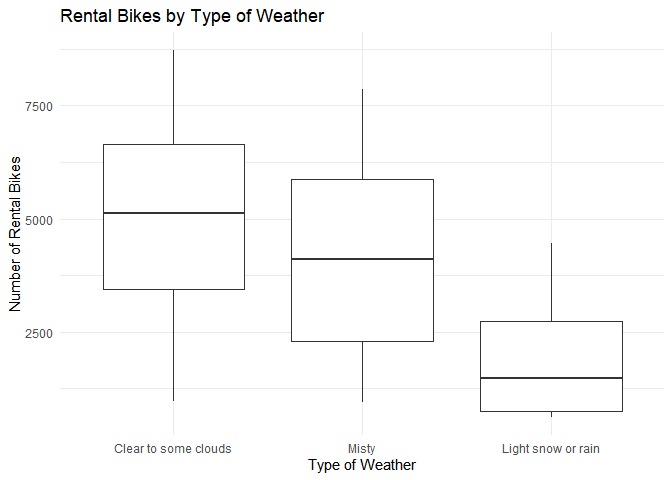
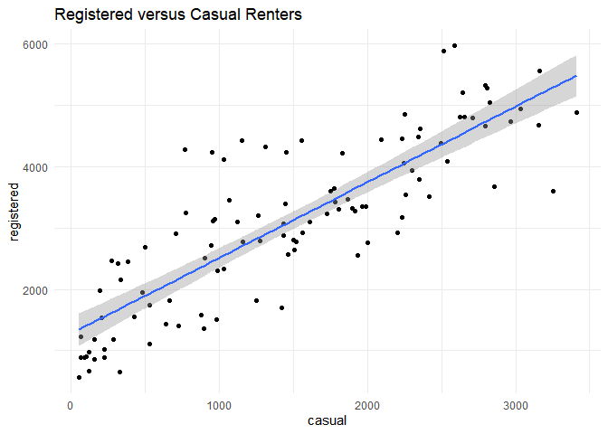
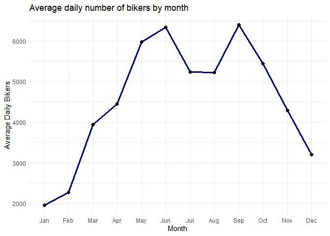
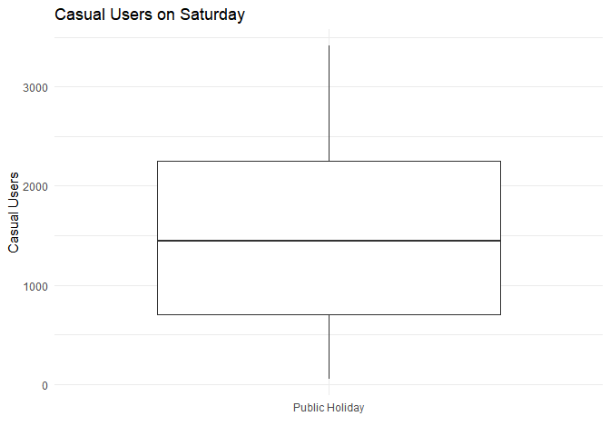
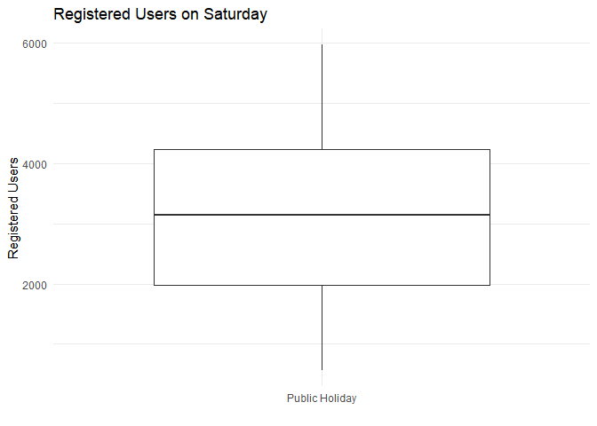
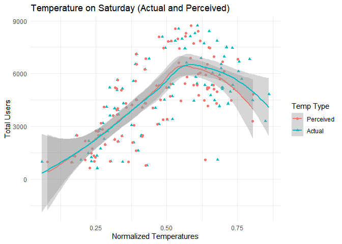
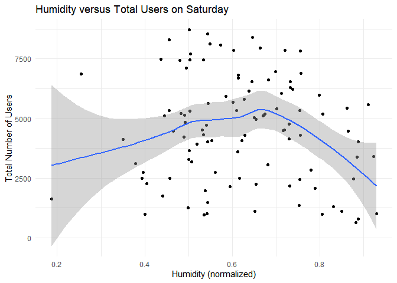
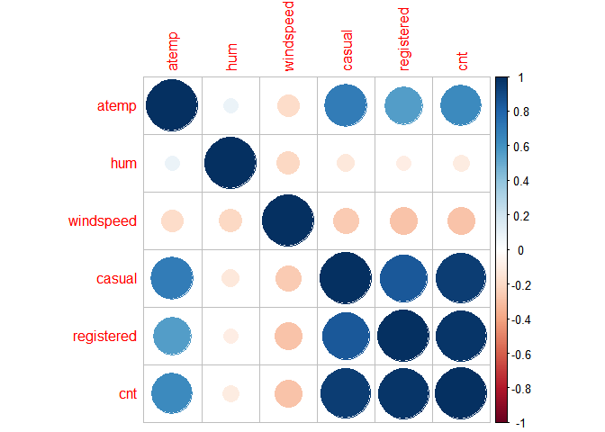
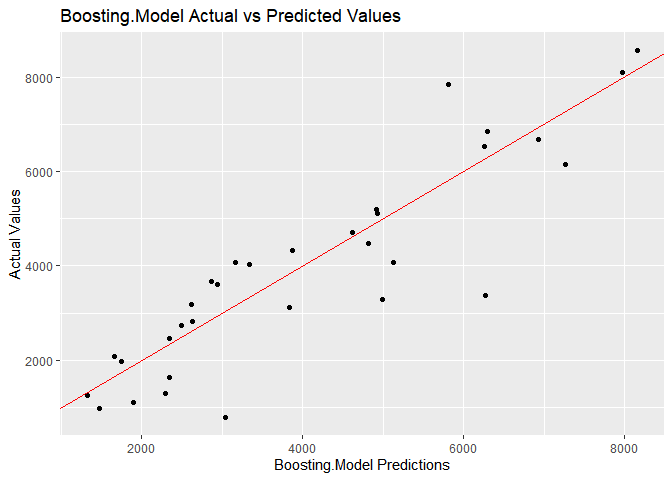

ST558 Project 2
================
Crista Gregg and Halid Kopanski
7/2/2021

-   [Introduction](#introduction)
-   [Data](#data)
-   [Summarizations](#summarizations)
    -   [Summary statistics of users](#summary-statistics-of-users)
    -   [Rentals by Year](#rentals-by-year)
    -   [Types of weather by season](#types-of-weather-by-season)
    -   [Rentals by Weather](#rentals-by-weather)
    -   [Casual vs. Registered bikers](#casual-vs-registered-bikers)
    -   [Average bikers by month](#average-bikers-by-month)
    -   [Holiday and Temperature / Humidity
        data](#holiday-and-temperature--humidity-data)
    -   [Correlation among numeric
        predictors](#correlation-among-numeric-predictors)
-   [Modeling](#modeling)
    -   [Linear Regression](#linear-regression)
        -   [Linear Fit 1](#linear-fit-1)
        -   [Linear Fit 2](#linear-fit-2)
    -   [Ensemble Tree](#ensemble-tree)
        -   [Random Forests](#random-forests)
        -   [Boosting Model](#boosting-model)
-   [Comparison](#comparison)

# Introduction

The following analysis breaks down bicycle sharing usage based on data
gathered for every recorded Saturday in the years 2011 and 2012. The
data was gathered from users of Capitol Bikeshare based in Washington
DC. In total, the dataset contains 731 entries. For each entry, 16
variables were recorded. The following is the list of the 16 variables
and a short description of each:

| Variable   |                                                    Description                                                    |
|------------|:-----------------------------------------------------------------------------------------------------------------:|
| instant    |                                                   record index                                                    |
| dteday     |                                                       date                                                        |
| season     |                                       season (winter, spring, summer, fall)                                       |
| yr         |                                                 year (2011, 2012)                                                 |
| mnth       |                                                 month of the year                                                 |
| holiday    |                                    whether that day is holiday (1) or not (0)                                     |
| weekday    |                                                  day of the week                                                  |
| workingday |                       if day is neither a weekend nor a holiday value is 1, otherwise is 0.                       |
| weathersit |                                   Description of weather conditions (see below)                                   |
| \-         |                                1: Clear, Few clouds, Partly cloudy, Partly cloudy                                 |
| \-         |                          2: Mist + Cloudy, Mist + Broken clouds, Mist + Few clouds, Mist                          |
| \-         |            3: Light Snow, Light Rain + Thunderstorm + Scattered clouds, Light Rain + Scattered clouds             |
| \-         |                           4: Heavy Rain + Ice Pallets + Thunderstorm + Mist, Snow + Fog                           |
| temp       |                                        Normalized temperature in Celsius.                                         |
| atemp      |                                   Normalized perceived temperature in Celsius.                                    |
| hum        |                                               Normalized humidity.                                                |
| windspeed  |                                              Normalized wind speed.                                               |
| casual     |                                               count of casual users                                               |
| registered |                                             count of registered users                                             |
| cnt        |                                      sum of both casual and registered users                                      |
| *Sources*  | *Raw data and more information can be found [here](https://archive.ics.uci.edu/ml/datasets/Bike+Sharing+Dataset)* |

In addition to summary statistics, this report will also model bicycle
users by linear regression, random forests, and boosting. The model will
help determine anticipated number of users based on readily available
data. To achieve this, the response variables are casual, registered,
and cnt. The other variables, not including the date and instant
columns, will be the predictors for models developed later in this
report.

# Data

Here, we set up the data for the selected day of week and convert
categorical variables to factors, and then split the data into a train
and test set.

``` r
set.seed(1) #get the same splits every time
bikes <- read_csv('day.csv')

day_function <- function(x){
  x <- x + 1
  switch(x,"Sunday", 
           "Monday", 
           "Tuesday", 
           "Wednesday", 
           "Thursday", 
           "Friday", 
           "Saturday")
}

season_function <- function(x){
    #x <- as.character(x)
    switch(x, "Spring",
              "Summer",
              "Fall",
              "Winter")
}

bikes <- bikes %>% select(everything()) %>% 
  mutate(weekday = sapply(weekday, day_function), 
         season = sapply(season, season_function)) 
  

bikes$season <- as.factor(bikes$season)
bikes$yr <- as.factor(bikes$yr)
levels(bikes$yr) <- c('2011','2012')
bikes$mnth <- as.factor(bikes$mnth)
bikes$holiday <- as.factor(bikes$holiday)
bikes$weekday <- as.factor(bikes$weekday)
bikes$workingday <- as.factor(bikes$workingday)
bikes$weathersit <- as.factor(bikes$weathersit)
levels(bikes$weathersit) <- c('Clear to some clouds', 'Misty', 'Light snow or rain')

day <- params$day_of_week

#filter bikes by day of week
bikes <- filter(bikes, weekday == day)

#split data into train and test sets
train_rows <- sample(nrow(bikes), 0.7*nrow(bikes))
train <- bikes[train_rows,] %>% 
  select(-instant, -weekday, -casual, -registered, -dteday)
test <- bikes[-train_rows,] %>% 
  select(-instant, -weekday, -casual, -registered, -dteday)
```

# Summarizations

## Summary statistics of users

Below shows the summary statistics of bike users: casual, registered,
and total.

``` r
knitr::kable(summary(bikes[,14:16]))
```

|     | casual       | registered   | cnt          |
|:----|:-------------|:-------------|:-------------|
|     | Min. : 57    | Min. : 570   | Min. : 627   |
|     | 1st Qu.: 706 | 1st Qu.:1977 | 1st Qu.:2732 |
|     | Median :1448 | Median :3150 | Median :4521 |
|     | Mean :1465   | Mean :3085   | Mean :4551   |
|     | 3rd Qu.:2247 | 3rd Qu.:4232 | 3rd Qu.:6140 |
|     | Max. :3410   | Max. :5966   | Max. :8714   |

## Rentals by Year

The following table tells us the total number of rentals for each of the
two years of collected data, as well as the average number of rentals
per day.

``` r
bikes %>%
  group_by(yr) %>%
  summarise(total_rentals = sum(cnt), avg_rentals = round(mean(cnt))) %>%
  knitr::kable()
```

| yr   | total\_rentals | avg\_rentals |
|:-----|---------------:|-------------:|
| 2011 |         179743 |         3391 |
| 2012 |         298064 |         5732 |

## Types of weather by season

Now we will look at the number of days with each type of weather by
season. 1 represents ‘Clear to some clouds’, 2 represents ‘Misty’, and 3
represents ‘Light snow or rain’.

``` r
knitr::kable(table(bikes$season, bikes$weathersit))
```

|        | Clear to some clouds | Misty | Light snow or rain |
|:-------|---------------------:|------:|-------------------:|
| Fall   |                   17 |     9 |                  1 |
| Spring |                   16 |    10 |                  1 |
| Summer |                   17 |     8 |                  1 |
| Winter |                   17 |     7 |                  1 |

## Rentals by Weather

The following box plot shows us how many rentals we have for days that
are sunny or partly cloudy, misty, or rainy/snowy. We may expect some
differences in behavior between weekend days where less people might be
inclined to ride their bikes for pleasure, versus weekdays when more
people might brave moderately unpleasant weather to get to work.

``` r
ggplot(bikes, aes(factor(weathersit), cnt)) +
  geom_boxplot() +
  labs(x = 'Type of Weather', y = 'Number of Rental Bikes', title = 'Rental Bikes by Type of Weather') +
  theme_minimal()
```

<!-- -->

``` r
weather_summary <- bikes %>%
  group_by(weathersit) %>%
  summarise(total_rentals = sum(cnt), avg_rentals = round(mean(cnt)))

weather_min <- switch(which.min(weather_summary$avg_rentals),
                               "clear weather",
                                                             "misty weather",
                                                             "weather with light snow or rain")
```

According to the above box plot, it can be seen that weather with light
snow or rain brings out the least amount of total users.

## Casual vs. Registered bikers

Below is a chart of the relationship between casual and registered
bikers. We might expect a change in the slope if we look at different
days of the week. Perhaps we see more registered bikers riding on the
weekday but more casual users on the weekend.

``` r
ggplot(bikes, aes(casual, registered)) +
  geom_point() +
  geom_smooth(formula = 'y ~ x', method = 'lm') +
  theme_minimal() +
  labs(title = 'Registered versus Casual Renters')
```

<!-- -->

## Average bikers by month

Below we see a plot of the average daily number of bikers by month. We
should expect to see more bikers in the spring and summer months, and
the least in the winter.

``` r
plot_mth <- bikes %>%
  group_by(mnth) %>%
  summarize(avg_bikers = mean(cnt))

ggplot(plot_mth, aes(mnth, avg_bikers)) +
  geom_line(group = 1, color = 'darkblue', size = 1.2) +
  geom_point(size = 2) +
  theme_minimal() +
  labs(title='Average daily number of bikers by month', y = 'Average Daily Bikers', x = 'Month') +
  scale_x_discrete(labels = month.abb)
```

<!-- -->

``` r
month_max <- month.name[which.max(plot_mth$avg_bikers)]
month_min <- month.name[which.min(plot_mth$avg_bikers)]

user_max <- max(plot_mth$avg_bikers)
user_min <- min(plot_mth$avg_bikers)

changes <- rep(0, 11)
diff_mth <- rep("x", 11)

for (i in 2:12){
  diff_mth[i - 1] <- paste(month.name[i - 1], "to", month.name[i])
  changes[i - 1] <- round(plot_mth$avg_bikers[i] - plot_mth$avg_bikers[i - 1])
}


diff_tab_mth <- as_tibble(cbind(diff_mth, changes))
```

According to the graph, September has the highest number of users with a
value of 6394. The month with the lowest number of users is January with
an average of 1957.

The largest decrease in month to month users was October to November
with an average change of -1157.

The largest increase in month to month users was February to March with
an average change of 1672.

## Holiday and Temperature / Humidity data

We would like to see what effect public holidays have on the types of
bicycle users on average for a given day. In this case, Saturday data
shows the following relationships:

``` r
bikes %>% ggplot(aes(x = as.factor(workingday), y = casual)) + geom_boxplot() + 
                labs(title = paste("Casual Users on", params$day_of_week)) + 
                xlab("") + 
                ylab("Casual Users") + 
                scale_x_discrete(labels = c('Public Holiday', 'Workday')) + 
                theme_minimal()
```

<!-- -->

``` r
bikes %>% ggplot(aes(x = as.factor(workingday), y = registered)) + geom_boxplot() + 
                labs(title = paste("Registered Users on", params$day_of_week)) + 
                xlab("") + 
                ylab("Registered Users") +
                scale_x_discrete(labels = c('Public Holiday', 'Workday')) +
                theme_minimal()
```

<!-- -->

Temperature and humidity have an effect on the number of users on a
given day.

First, normalized temperature data (both actual temperature and
perceived):

``` r
bike_temp <- bikes %>% select(cnt, temp, atemp) %>% 
                    gather(key = type, value = temp_norm, temp, atemp, factor_key = FALSE)

ggplot(bike_temp, aes(x = temp_norm, y = cnt, col = type, shape = type)) + 
        geom_point() + geom_smooth(formula = 'y ~ x', method = 'loess') +
        scale_color_discrete(name = "Temp Type", labels = c("Perceived", "Actual")) +
        scale_shape_discrete(name = "Temp Type", labels = c("Perceived", "Actual")) +
        labs(title = paste("Temperature on", params$day_of_week, "(Actual and Perceived)")) +
        xlab("Normalized Temperatures") +
        ylab("Total Users") + 
        theme_minimal()
```

<!-- -->

Next the effect of humidity:

``` r
bikes%>% ggplot(aes(x = hum, y = cnt)) + geom_point() + geom_smooth(formula = 'y ~ x', method = 'loess') +
                labs(title = paste("Humidity versus Total Users on", params$day_of_week)) +
                xlab("Humidity (normalized)") +
                ylab("Total Number of Users") +
                theme_minimal()
```

<!-- -->

## Correlation among numeric predictors

Here we are checking the correlation between the numeric predictors in
the data.

``` r
knitr::kable(round(cor(bikes[ , c(11:16)]), 3))
```

|            |  atemp |    hum | windspeed | casual | registered |    cnt |
|:-----------|-------:|-------:|----------:|-------:|-----------:|-------:|
| atemp      |  1.000 |  0.087 |    -0.181 |  0.695 |      0.558 |  0.638 |
| hum        |  0.087 |  1.000 |    -0.210 | -0.124 |     -0.092 | -0.109 |
| windspeed  | -0.181 | -0.210 |     1.000 | -0.258 |     -0.282 | -0.283 |
| casual     |  0.695 | -0.124 |    -0.258 |  1.000 |      0.843 |  0.943 |
| registered |  0.558 | -0.092 |    -0.282 |  0.843 |      1.000 |  0.974 |
| cnt        |  0.638 | -0.109 |    -0.283 |  0.943 |      0.974 |  1.000 |

``` r
corrplot(cor(bikes[ , c(11:16)]), method = "circle")
```

<!-- -->

# Modeling

Now, we will fit two linear regression model, a random forest model, and
a boosting model. We will use cross-validation to select the best tuning
parameters for the ensemble based methods, and then compare all four
models using the test MSE.

## Linear Regression

Linear regression is one of the most common methods for modeling. It
looks at a set of predictors and estimates what will happen to the
response if one of the predictors or a combination of predictors change.
This model is highly interpretable, as it shows us the effect of each
individual predictor as well as interactions. We can see if the change
in the response goes up or down and in what quantity. The model is
chosen by minimizing the squares of the distances between the estimated
value and the actual value in the testing set. Below we fit two
different linear regression models.

### Linear Fit 1

The first model will have a subset of predictors chosen by stepwise
selection. Once we have chosen an interesting set of predictors, we will
use cross-validation to determine the RMSE and R<sup>2</sup>.

``` r
lm_fit_select <- lm(cnt ~ ., data = train[ , c(1:3, 6:11)])
model <- step(lm_fit_select)
```

    ## Start:  AIC=1022.01
    ## cnt ~ season + yr + mnth + weathersit + temp + atemp + hum + 
    ##     windspeed
    ## 
    ##              Df Sum of Sq       RSS    AIC
    ## - mnth       11  14281956  62336194 1019.0
    ## - weathersit  2   1563114  49617353 1020.4
    ## - temp        1   1306250  49360489 1022.0
    ## <none>                     48054239 1022.0
    ## - hum         1   1573839  49628078 1022.4
    ## - windspeed   1   2024143  50078382 1023.0
    ## - atemp       1   2746096  50800335 1024.1
    ## - season      3  10460175  58514414 1030.4
    ## - yr          1  63071388 111125627 1081.2
    ## 
    ## Step:  AIC=1019
    ## cnt ~ season + yr + weathersit + temp + atemp + hum + windspeed
    ## 
    ##              Df Sum of Sq       RSS    AIC
    ## - weathersit  2   2365434  64701629 1017.7
    ## - hum         1    813400  63149595 1018.0
    ## <none>                     62336194 1019.0
    ## - windspeed   1   2181539  64517733 1019.5
    ## - temp        1   3413880  65750075 1020.9
    ## - atemp       1   5884572  68220766 1023.6
    ## - season      3  23620695  85956889 1036.5
    ## - yr          1  68279653 130615847 1071.0
    ## 
    ## Step:  AIC=1017.72
    ## cnt ~ season + yr + temp + atemp + hum + windspeed
    ## 
    ##             Df Sum of Sq       RSS    AIC
    ## <none>                    64701629 1017.7
    ## - windspeed  1   2998435  67700064 1019.0
    ## - temp       1   4191933  68893562 1020.3
    ## - atemp      1   7839136  72540764 1024.1
    ## - hum        1   9337175  74038804 1025.6
    ## - season     3  22272952  86974580 1033.3
    ## - yr         1  66650278 131351907 1067.4

``` r
variables <- names(model$model)
variables #variables we will use for our model
```

    ## [1] "cnt"       "season"    "yr"        "temp"      "atemp"     "hum"       "windspeed"

``` r
set.seed(10)
lm.fit <- train(cnt ~ ., data = train[variables], method = 'lm',
                preProcess = c('center', 'scale'),
                trControl = trainControl(method = 'cv', number = 10))
lm.fit
```

    ## Linear Regression 
    ## 
    ## 73 samples
    ##  6 predictor
    ## 
    ## Pre-processing: centered (8), scaled (8) 
    ## Resampling: Cross-Validated (10 fold) 
    ## Summary of sample sizes: 65, 65, 66, 65, 66, 66, ... 
    ## Resampling results:
    ## 
    ##   RMSE      Rsquared   MAE     
    ##   1069.228  0.7858591  833.1713
    ## 
    ## Tuning parameter 'intercept' was held constant at a value of TRUE

Our first linear model has an RMSE of 1069.23.

### Linear Fit 2

Adding interactions to the terms included in the first model.

``` r
set.seed(10)
lm.fit1 <- train(cnt ~ . + .*., data = train[variables], method = 'lm',
                preProcess = c('center', 'scale'),
                trControl = trainControl(method = 'cv', number = 10))
lm.fit1
```

    ## Linear Regression 
    ## 
    ## 73 samples
    ##  6 predictor
    ## 
    ## Pre-processing: centered (33), scaled (33) 
    ## Resampling: Cross-Validated (10 fold) 
    ## Summary of sample sizes: 65, 65, 66, 65, 66, 66, ... 
    ## Resampling results:
    ## 
    ##   RMSE     Rsquared   MAE     
    ##   1130.26  0.8066662  829.2056
    ## 
    ## Tuning parameter 'intercept' was held constant at a value of TRUE

The RMSE value of the model changed to 1130.26.

## Ensemble Tree

Ensemble trees methods come in many types and are very versatile when it
comes to regression or classification. For the following, we will be
using the two most common and well known methods: Random Forests (a form
of bagging) and Boosting. Both these tree based methods involve
optimization during the development process. In the case of random
forests, the optimization involves varying the number of predictors
used. This is done to mitigate the effects of one or more predictors
from overshadowing other predictors. Boosting is a method where the
final model is developed through an iterative combination of weaker
models where each iteration builds upon the last. While both methods are
very flexible and tend to process good results, the models themselves
are not as interpretable as linear regression. We normally just analyze
the output of the models.

### Random Forests

Below is the result of training with the random forest method. This
method uses a different subset of predictors for each tree and averages
the results across many trees, selected by bootstrapping. By reducing
the number of predictors considered in each tree, we may be able to
reduce the correlation between trees to improve our results. In the
training model below, we vary the number of predictors used in each
tree.

``` r
rf_fit <- train(cnt ~ ., data = train, method = 'rf',
                preProcess = c('center', 'scale'),
                tuneGrid = data.frame(mtry = 1:10))
rf_fit
```

    ## Random Forest 
    ## 
    ## 73 samples
    ## 10 predictors
    ## 
    ## Pre-processing: centered (23), scaled (23) 
    ## Resampling: Bootstrapped (25 reps) 
    ## Summary of sample sizes: 73, 73, 73, 73, 73, 73, ... 
    ## Resampling results across tuning parameters:
    ## 
    ##   mtry  RMSE      Rsquared   MAE      
    ##    1    1653.055  0.6816528  1365.3999
    ##    2    1306.146  0.7269347  1089.0003
    ##    3    1163.616  0.7618075   954.9998
    ##    4    1107.706  0.7714164   900.3658
    ##    5    1073.693  0.7812969   868.2078
    ##    6    1057.214  0.7823208   848.7505
    ##    7    1045.592  0.7839684   836.9043
    ##    8    1040.958  0.7818392   831.2740
    ##    9    1038.137  0.7807805   826.7751
    ##   10    1033.342  0.7800481   819.6742
    ## 
    ## RMSE was used to select the optimal model using the smallest value.
    ## The final value used for the model was mtry = 10.

The best model uses 10 predictors. This gives an RMSE of 1033.34.

### Boosting Model

The following are the results of Boosting model development using the
provided bike data.

``` r
trctrl <- trainControl(method = "repeatedcv", 
                       number = 10, 
                       repeats = 3)

set.seed(2020)

boost_grid <- expand.grid(n.trees = c(20, 100, 500),
                          interaction.depth = c(1, 3, 5),
                          shrinkage = c(0.1, 0.01, 0.001),
                          n.minobsinnode = 10)

boost_fit <-  train(cnt ~ ., 
                    data = train, 
                    method = "gbm", 
                    verbose = F, #suppresses excessive printing while model is training
                    trControl = trctrl, 
                    tuneGrid = data.frame(boost_grid))
```

A total of 27 models were evaluated. Each differing by the combination
of boosting parameters. The results are show below:

``` r
print(boost_fit)
```

    ## Stochastic Gradient Boosting 
    ## 
    ## 73 samples
    ## 10 predictors
    ## 
    ## No pre-processing
    ## Resampling: Cross-Validated (10 fold, repeated 3 times) 
    ## Summary of sample sizes: 66, 65, 65, 65, 65, 65, ... 
    ## Resampling results across tuning parameters:
    ## 
    ##   shrinkage  interaction.depth  n.trees  RMSE      Rsquared   MAE      
    ##   0.001      1                   20      2136.278  0.5491804  1764.9936
    ##   0.001      1                  100      2072.116  0.5674571  1716.0687
    ##   0.001      1                  500      1817.425  0.6510591  1509.3856
    ##   0.001      3                   20      2133.369  0.6450387  1762.7425
    ##   0.001      3                  100      2059.580  0.6607676  1706.2319
    ##   0.001      3                  500      1763.464  0.7095491  1467.0325
    ##   0.001      5                   20      2133.752  0.6355773  1762.8511
    ##   0.001      5                  100      2058.870  0.6653093  1705.6937
    ##   0.001      5                  500      1764.942  0.7076411  1468.6777
    ##   0.010      1                   20      1998.841  0.6073484  1655.2472
    ##   0.010      1                  100      1586.812  0.7059515  1324.0320
    ##   0.010      1                  500      1083.614  0.7888237   873.3991
    ##   0.010      3                   20      1977.281  0.6695179  1638.9404
    ##   0.010      3                  100      1521.317  0.7279731  1272.6865
    ##   0.010      3                  500      1051.561  0.7958561   845.2835
    ##   0.010      5                   20      1968.075  0.6932872  1634.4492
    ##   0.010      5                  100      1517.609  0.7291343  1271.8596
    ##   0.010      5                  500      1065.198  0.7931159   858.8455
    ##   0.100      1                   20      1324.561  0.7216490  1095.6062
    ##   0.100      1                  100      1021.379  0.8064630   807.6157
    ##   0.100      1                  500      1021.585  0.8047269   824.9930
    ##   0.100      3                   20      1250.611  0.7589343  1034.3633
    ##   0.100      3                  100      1010.058  0.8111796   807.3082
    ##   0.100      3                  500      1033.108  0.8021325   814.6815
    ##   0.100      5                   20      1272.907  0.7334653  1050.1982
    ##   0.100      5                  100      1036.085  0.7966988   822.4182
    ##   0.100      5                  500      1032.406  0.7990493   817.0820
    ## 
    ## Tuning parameter 'n.minobsinnode' was held constant at a value of 10
    ## RMSE was used to select the optimal model using the smallest value.
    ## The final values used for the model were n.trees = 100, interaction.depth = 3, shrinkage
    ##  = 0.1 and n.minobsinnode = 10.

``` r
results_tab <- as_tibble(boost_fit$results[,c(1,2,4:6)])
```

The attributes of the best model is shown here.

``` r
boost_min <- which.min(results_tab$RMSE)

knitr::kable(results_tab[boost_min,], digits = 2)
```

| shrinkage | interaction.depth | n.trees |    RMSE | Rsquared |
|----------:|------------------:|--------:|--------:|---------:|
|       0.1 |                 3 |     100 | 1010.06 |     0.81 |

# Comparison

Here we compare the 4 models developed earlier. Each model was applied
to a test set and the results were then used to calculate MSE. Below are
the results.

``` r
lm_pred <- predict(lm.fit, newdata = test)
lm_pred1 <- predict(lm.fit1, newdata = test)
rf_pred <- predict(rf_fit, newdata = test)
boost_pred <- predict(boost_fit, newdata = test)

prediction_values <- as_tibble(cbind(lm_pred, lm_pred1, rf_pred, boost_pred))

lm_MSE <- mean((lm_pred - test$cnt)^2)
lm_MSE1 <- mean((lm_pred1 - test$cnt)^2)
rf_MSE <- mean((rf_pred - test$cnt)^2)
boost_MSE <- mean((boost_pred - test$cnt)^2)

comp <- data.frame('Linear Model 1' = lm_MSE, 
                   'Linear Model 2' = lm_MSE1, 
                   'Random Forest Model' = rf_MSE, 
                   'Boosting Model' = boost_MSE)

knitr::kable(t(comp), col.names = "MSE")
```

|                     |       MSE |
|:--------------------|----------:|
| Linear.Model.1      | 1265720.1 |
| Linear.Model.2      | 2947361.9 |
| Random.Forest.Model | 1063519.2 |
| Boosting.Model      |  931677.6 |

It was found that Boosting.Model achieves the lowest test MSE of
9.3167761^{5} for Saturday data.

Below is a graph of the Actual vs Predicted results:

``` r
index_val <- (which.min(t(comp)))

results_plot <- as_tibble(cbind("preds" = prediction_values[[index_val]], "actual" = test$cnt))

ggplot(data = results_plot, aes(preds, actual)) + geom_point() +
     labs(x = paste(names(which.min(comp)), "Predictions"), y = "Actual Values",
     title = paste(names(which.min(comp)), "Actual vs Predicted Values")) +
     geom_abline(slope = 1, intercept = 0, col = 'red')
```

<!-- -->
