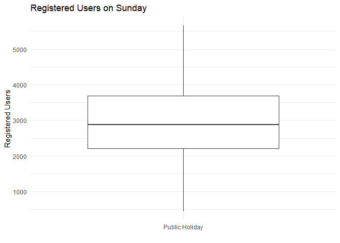
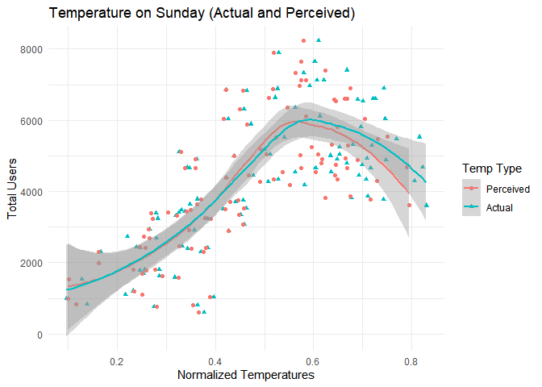

ST558 Project 2
================
Crista Gregg and Halid Kopanski
7/2/2021

-   [Introduction](#introduction)
-   [Data](#data)
-   [Summarizations](#summarizations)
    -   [Rentals by Year](#rentals-by-year)
    -   [Rentals by Weather](#rentals-by-weather)
    -   [Casual vs. Registered bikers](#casual-vs-registered-bikers)
    -   [Average bikers by month](#average-bikers-by-month)
    -   [Holiday and Temp/Hum data](#holiday-and-temphum-data)
    -   [Correlation among numeric
        predictors](#correlation-among-numeric-predictors)
-   [Modeling](#modeling)
    -   [Linear Regression](#linear-regression)
        -   [Linear Fit 1](#linear-fit-1)
        -   [Linear Fit 2](#linear-fit-2)
    -   [Ensemble Tree](#ensemble-tree)
        -   [Random Forests](#random-forests)
        -   [Boosting Model](#boosting-model)
-   [Comparison](#comparison)

# Introduction

The following analysis breaks down bicycle sharing usage based on data
gathered for every recorded Sunday in the years 2011 and 2012. The data
was gathered from users of Capitol Bikeshare based in Washington DC. In
total, the dataset contains 731 entries. For each entry, 16 variables
were recorded. The following is the list of the 16 variables and a short
description of each:

| Variable   |                                                    Description                                                    |
|------------|:-----------------------------------------------------------------------------------------------------------------:|
| instant    |                                                   record index                                                    |
| dteday     |                                                       date                                                        |
| season     |                                       season (winter, spring, summer, fall)                                       |
| yr         |                                                 year (2011, 2012)                                                 |
| mnth       |                                                 month of the year                                                 |
| holiday    |                            whether day is holiday or not (extracted from \[Web Link\])                            |
| weekday    |                                                  day of the week                                                  |
| workingday |                            if day is neither weekend nor holiday is 1, otherwise is 0.                            |
| weathersit |                                                                                                                   |
| \-         |                                1: Clear, Few clouds, Partly cloudy, Partly cloudy                                 |
| \-         |                          2: Mist + Cloudy, Mist + Broken clouds, Mist + Few clouds, Mist                          |
| \-         |            3: Light Snow, Light Rain + Thunderstorm + Scattered clouds, Light Rain + Scattered clouds             |
| \-         |                           4: Heavy Rain + Ice Pallets + Thunderstorm + Mist, Snow + Fog                           |
| temp       |                                        Normalized temperature in Celsius.                                         |
| atemp      |                                   Normalized perceived temperature in Celsius.                                    |
| hum        |                                               Normalized humidity.                                                |
| windspeed  |                                              Normalized wind speed.                                               |
| casual     |                                               count of casual users                                               |
| registered |                                             count of registered users                                             |
| cnt        |                                      sum of both casual and registered users                                      |
| *Sources*  | *Raw data and more information can be found [here](https://archive.ics.uci.edu/ml/datasets/Bike+Sharing+Dataset)* |

In addition to summary statistics, this report will also model bicycle
users linear regression, random forests, and boosting. The model will
help determine anticipated number of users based on readily available
data. To achieve this, the response variables are casual, registered,
and cnt. The other 13 variables will be the predictors for models
developed later in this report.

# Data

``` r
set.seed(1)
bikes <- read_csv('day.csv')

day_function <- function(x){
  x <- as.character(x)
  switch(x, "0" = "Sunday", 
         "1" = "Monday", 
         "2" = "Tuesday", 
         "3" = "Wednesday", 
         "4" = "Thursday", 
         "5" = "Friday", 
         "6" = "Saturday")
}

season_function <- function(x){
    x <- as.character(x)
    switch(x, "1" = "Spring",
              "2" = "Summer",
              "3" = "Fall",
              "4" = "Winter")
}

bikes <- bikes %>% select(everything()) %>% 
  mutate(weekday = sapply(weekday, day_function), 
         season = sapply(season, season_function)) 
  

bikes$season <- as.factor(bikes$season)
bikes$yr <- as.factor(bikes$yr)
levels(bikes$yr) <- c('2019','2020')
bikes$mnth <- as.factor(bikes$mnth)
bikes$holiday <- as.factor(bikes$holiday)
bikes$weekday <- as.factor(bikes$weekday)
bikes$workingday <- as.factor(bikes$workingday)
bikes$weathersit <- as.factor(bikes$weathersit)

day <- params$day_of_week

#filter bikes by day of week
bikes <- filter(bikes, weekday == day)

#split data into train and test sets
train_rows <- sample(nrow(bikes), 0.7*nrow(bikes))
train <- bikes[train_rows,] %>% 
  select(-instant, -weekday, -casual, -registered)
test <- bikes[-train_rows,] %>% 
  select(-instant, -weekday, -casual, -registered)
```

# Summarizations

## Rentals by Year

The following table tells us the total number of rentals for each of the
two years of collected data, as well as the average number of rentals
per day.

``` r
bikes %>%
  group_by(yr) %>%
  summarise(total_rentals = sum(cnt), avg_rentals = round(mean(cnt)))
```

    ## # A tibble: 2 x 3
    ##   yr    total_rentals avg_rentals
    ##   <fct>         <dbl>       <dbl>
    ## 1 2019         177074        3405
    ## 2 2020         266953        5037

## Rentals by Weather

The following box plot shows us how many rentals we have for days that
are sunny or partly cloudy, misty, or rainy/snowy. We may expect some
differences in behavior between weekend days where less people might be
inclined to ride their bikes for pleasure, versus weekdays when more
people might brave moderately unpleasant weather to get to work.

``` r
ggplot(bikes, aes(factor(weathersit), cnt)) +
  geom_boxplot() +
  labs(x = 'Type of Weather', y = 'Number of Rental Bikes', title = 'Rental Bikes by Type of Weather') +
  scale_x_discrete(labels = c('Clear to some clouds', 'Misty', 'Light snow or rain')) +
  theme_minimal()
```

<!-- -->

## Casual vs. Registered bikers

Below is a chart of the relationship between casual and registered
bikers. We might expect a change in the slope if we look at different
days of the week. Perhaps we see more registered bikers riding on the
weekday but more casual users on the weekend.

``` r
ggplot(bikes, aes(casual, registered)) +
  geom_point() +
  geom_smooth(method = 'lm') +
  theme_minimal() +
  labs(title = 'Registered versus Casual Renters')
```

    ## `geom_smooth()` using formula 'y ~ x'

<!-- -->

## Average bikers by month

Below we see a plot of the average daily number of bikers by month. We
should expect to see more bikers in the spring and summer months, and
the least in the winter.

``` r
plot_mth <- bikes %>%
  group_by(mnth) %>%
  summarize(avg_bikers = mean(cnt))

ggplot(plot_mth, aes(mnth, avg_bikers)) +
  geom_line(group = 1, color = 'darkblue', size = 1.2) +
  geom_point(size = 2) +
  theme_minimal() +
  labs(title='Average daily number of bikers by month', y = 'Average Daily Bikers', x = 'Month') +
  scale_x_discrete(labels = month.abb)
```

<!-- -->

## Holiday and Temp/Hum data

We would like to see what affect public holidays have on the types of
bicycle users for a given day. In this case, Sunday show the following
relationships:

``` r
bikes %>% ggplot(aes(x = as.factor(workingday), y = casual)) + geom_boxplot() + 
                labs(title = paste("Casual Users on", params$day_of_week)) + 
                xlab("") + 
                ylab("Casual Users") + 
                scale_x_discrete(labels = c('Public Holiday', 'Workday')) + 
                theme_minimal()
```

<!-- -->

``` r
bikes %>% ggplot(aes(x = as.factor(workingday), y = registered)) + geom_boxplot() + 
                labs(title = paste("Registered Users on", params$day_of_week)) + 
                xlab("") + 
                ylab("Registered Users") +
                scale_x_discrete(labels = c('Public Holiday', 'Workday')) +
                theme_minimal()
```

<!-- -->

Temperature and Humidity have an affect on the number of users on a
given day

First, normalized temperature data (both actual temperature and
perceived):

``` r
bike_temp <- bikes %>% select(cnt, temp, atemp) %>% 
                    gather(key = type, value = temp_norm, temp, atemp, factor_key = FALSE)

ggplot(bike_temp, aes(x = temp_norm, y = cnt, col = type, shape = type)) + 
        geom_point() + geom_smooth(formula = 'y ~ x', method = 'loess') +
        scale_color_discrete(name = "Temp Type", labels = c("Perceived", "Actual")) +
        scale_shape_discrete(name = "Temp Type", labels = c("Perceived", "Actual")) +
        labs(title = paste("Temperature on", params$day_of_week, "(Actual and Perceived)")) +
        xlab("Normalized Temperatures") +
        ylab("Total Users") + 
        theme_minimal()
```

<!-- -->

Next the affect of humidity:

``` r
bikes%>% ggplot(aes(x = hum, y = cnt)) + geom_point() + geom_smooth(formula = 'y ~ x', method = 'loess') +
                labs(title = paste("Humidity versus Total Users on", params$day_of_week)) +
                xlab("Humidity (normalized)") +
                ylab("Total Number of Users") +
                theme_minimal()
```

<!-- -->

## Correlation among numeric predictors

Here we are checking the correlation between the numeric predictors in
the data

``` r
knitr::kable(round(cor(bikes[ , c(11:16)]), 3))
```

|            |  atemp |    hum | windspeed | casual | registered |    cnt |
|:-----------|-------:|-------:|----------:|-------:|-----------:|-------:|
| atemp      |  1.000 |  0.235 |    -0.230 |  0.729 |      0.587 |  0.685 |
| hum        |  0.235 |  1.000 |    -0.274 |  0.050 |      0.007 |  0.026 |
| windspeed  | -0.230 | -0.274 |     1.000 | -0.231 |     -0.273 | -0.272 |
| casual     |  0.729 |  0.050 |    -0.231 |  1.000 |      0.764 |  0.914 |
| registered |  0.587 |  0.007 |    -0.273 |  0.764 |      1.000 |  0.960 |
| cnt        |  0.685 |  0.026 |    -0.272 |  0.914 |      0.960 |  1.000 |

``` r
corrplot(cor(bikes[ , c(11:16)]), method = "circle")
```

<!-- -->

# Modeling

## Linear Regression

Linear regression is one of the most common methods for modeling. It
looks at a set of predictors and estimates what will happen to the
response if the predictors change. This model is highly interpretable,
as it shows us the effect of each individual predictor as well as
interactions. We can see if the change in the response goes up or down
and in what quantity. Below we fit two linear regression models.

### Linear Fit 1

The first model will have a subset of predictors chosen by stepwise
selection.

``` r
set.seed(10)
lm.fit <- train(cnt ~ season + yr + weathersit + atemp + hum + windspeed, data = train[, 2:12], method = 'lm',
                preProcess = c('center', 'scale'),
                trControl = trainControl(method = 'cv', number = 10))
lm.fit
```

    ## Linear Regression 
    ## 
    ## 73 samples
    ##  6 predictor
    ## 
    ## Pre-processing: centered (9), scaled (9) 
    ## Resampling: Cross-Validated (10 fold) 
    ## Summary of sample sizes: 65, 65, 66, 65, 66, 66, ... 
    ## Resampling results:
    ## 
    ##   RMSE      Rsquared  MAE     
    ##   1026.189  0.69611   797.5713
    ## 
    ## Tuning parameter 'intercept' was held constant at a value of TRUE

Our first linear model has an R<sup>2</sup> of 1026.1885563.

### Linear Fit 2

Using transformations of predictors identified in the first linear fit.

``` r
set.seed(10)
lm.fit1 <- train(cnt ~ season + yr + weathersit + poly(hum, 3) + I(atemp^0.5) + windspeed, data = train[, 2:12], method = 'lm',
                preProcess = c('center', 'scale'),
                trControl = trainControl(method = 'cv', number = 10))
lm.fit1
```

    ## Linear Regression 
    ## 
    ## 73 samples
    ##  6 predictor
    ## 
    ## Pre-processing: centered (11), scaled (11) 
    ## Resampling: Cross-Validated (10 fold) 
    ## Summary of sample sizes: 65, 65, 66, 65, 66, 66, ... 
    ## Resampling results:
    ## 
    ##   RMSE      Rsquared   MAE     
    ##   1026.636  0.7003754  799.5864
    ## 
    ## Tuning parameter 'intercept' was held constant at a value of TRUE

The R<sup>2</sup> value of the model changed to 1026.6357035

## Ensemble Tree

Ensemble trees methods come in many types and are very versatile when it
comes to regression or classification. For the following we will be
using the two most common and well known methods, Random Forests (a form
of bagging) and Boosting. Both these tree based methods involve
optimization during the development process. In the case of random
forests, the optimization involves varying the number of predictors
used. This is done to mitigate the effects of one or more predictors
from overshadowing other predictors. Boosting is method where the final
model is developed through an iterative combination of weaker models
where each interation builds upon the last. While both methods are very
flexible and tend to process good results the models themselves are as
interpretable as linear regression. We normally just analyze the output
of the models.

### Random Forests

### Boosting Model

The following are the results of Boosting model development using the
provided bike data

``` r
trctrl <- trainControl(method = "repeatedcv", 
                       number = 10, 
                       repeats = 3)

set.seed(2020)

boost_grid <- expand.grid(n.trees = c(20, 100, 500),
                          interaction.depth = c(1, 3, 5),
                          shrinkage = c(0.1, 0.01, 0.001),
                          n.minobsinnode = 10)

boost_fit <-  train(cnt ~ ., 
                    data = select(train, cnt, hum, temp, atemp, windspeed, workingday, season, weathersit, yr), 
                    method = "gbm", 
                    verbose = F, #suppresses excessive printing while model is training
                    trControl = trctrl, 
                    tuneGrid = data.frame(boost_grid))
```

A total of 27 models were evaluated. Each differing by the combination
of boosting parameters. The results are show below:

``` r
print(boost_fit)
```

    ## Stochastic Gradient Boosting 
    ## 
    ## 73 samples
    ##  8 predictor
    ## 
    ## No pre-processing
    ## Resampling: Cross-Validated (10 fold, repeated 3 times) 
    ## Summary of sample sizes: 66, 65, 65, 65, 65, 65, ... 
    ## Resampling results across tuning parameters:
    ## 
    ##   shrinkage  interaction.depth  n.trees  RMSE       Rsquared   MAE      
    ##   0.001      1                   20      1840.3221  0.5757905  1493.0212
    ##   0.001      1                  100      1771.5998  0.5787438  1435.5235
    ##   0.001      1                  500      1530.9440  0.6054489  1247.2737
    ##   0.001      3                   20      1838.2792  0.6687314  1491.3589
    ##   0.001      3                  100      1761.7458  0.6643410  1427.6782
    ##   0.001      3                  500      1483.1440  0.6825958  1206.2418
    ##   0.001      5                   20      1838.7181  0.6456000  1491.7626
    ##   0.001      5                  100      1762.2846  0.6595348  1428.1076
    ##   0.001      5                  500      1483.0400  0.6828798  1205.6452
    ##   0.010      1                   20      1698.4968  0.5655502  1377.1134
    ##   0.010      1                  100      1353.2797  0.6565321  1108.3018
    ##   0.010      1                  500      1015.0552  0.7470200   858.7482
    ##   0.010      3                   20      1678.3392  0.6594732  1361.1719
    ##   0.010      3                  100      1283.5388  0.7091377  1048.8383
    ##   0.010      3                  500       969.3181  0.7612156   806.1670
    ##   0.010      5                   20      1679.7214  0.6532403  1361.6328
    ##   0.010      5                  100      1288.1646  0.7113764  1053.1609
    ##   0.010      5                  500       963.1062  0.7656477   802.0867
    ##   0.100      1                   20      1148.6922  0.7103737   969.4285
    ##   0.100      1                  100       968.4765  0.7572250   796.7408
    ##   0.100      1                  500       951.9364  0.7695029   773.2968
    ##   0.100      3                   20      1108.8465  0.7207993   935.1638
    ##   0.100      3                  100       962.3362  0.7524299   777.2414
    ##   0.100      3                  500       975.3889  0.7492407   787.4195
    ##   0.100      5                   20      1094.5970  0.7362154   924.9330
    ##   0.100      5                  100       946.0414  0.7609759   762.9541
    ##   0.100      5                  500       948.7343  0.7555612   774.0997
    ## 
    ## Tuning parameter 'n.minobsinnode' was held constant at a value of 10
    ## RMSE was used to select the optimal model using the smallest value.
    ## The final values used for the model were n.trees = 100, interaction.depth = 5, shrinkage = 0.1 and n.minobsinnode = 10.

``` r
results_tab <- as_tibble(boost_fit$results[,c(1,2,4:6)])
```

The attributes of the best model is shown here.

``` r
boost_min <- which.min(results_tab$RMSE)

knitr::kable(results_tab[boost_min,])
```

| shrinkage | interaction.depth | n.trees |     RMSE |  Rsquared |
|----------:|------------------:|--------:|---------:|----------:|
|       0.1 |                 5 |     100 | 946.0414 | 0.7609759 |

# Comparison

``` r
lm_pred <- predict(lm.fit, newdata = test)
lm_pred1 <- predict(lm.fit1, newdata = test)
boost_pred <- predict(boost_fit, newdata = test)

lm_MSE <- mean((lm_pred - test$cnt)^2)
lm_MSE1 <- mean((lm_pred1 - test$cnt)^2)
boost_MSE <- mean((boost_pred - test$cnt)^2)

print(c(lm_MSE, lm_MSE1, boost_MSE))
```

    ## [1]  803770.6 1543280.4  473081.3

\`\`\`
