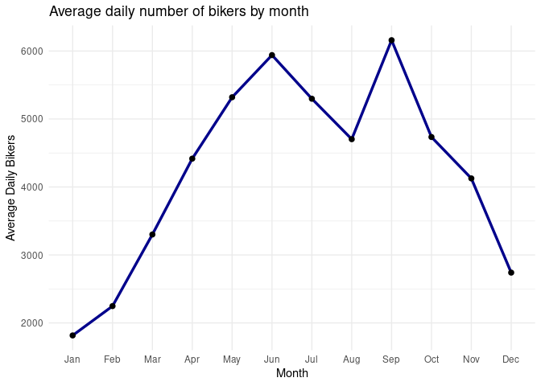
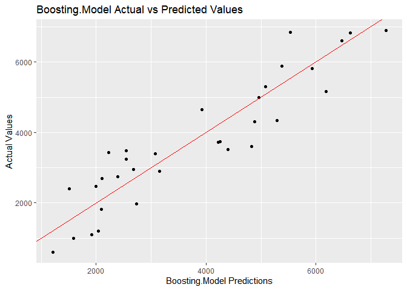

ST558 Project 2
================
Crista Gregg and Halid Kopanski
7/2/2021

-   [Introduction](#introduction)
-   [Data](#data)
-   [Summarizations](#summarizations)
    -   [Summary statistics of users](#summary-statistics-of-users)
    -   [Rentals by Year](#rentals-by-year)
    -   [Types of weather by season](#types-of-weather-by-season)
    -   [Rentals by Weather](#rentals-by-weather)
    -   [Casual vs. Registered bikers](#casual-vs-registered-bikers)
    -   [Average bikers by month](#average-bikers-by-month)
    -   [Holiday and Temperature / Humidity
        data](#holiday-and-temperature--humidity-data)
    -   [Correlation among numeric
        predictors](#correlation-among-numeric-predictors)
-   [Modeling](#modeling)
    -   [Linear Regression](#linear-regression)
        -   [Linear Fit 1](#linear-fit-1)
        -   [Linear Fit 2](#linear-fit-2)
    -   [Ensemble Tree](#ensemble-tree)
        -   [Random Forests](#random-forests)
        -   [Boosting Model](#boosting-model)
-   [Comparison](#comparison)

# Introduction

The following analysis breaks down bicycle sharing usage based on data
gathered for every recorded Sunday in the years 2011 and 2012. The data
was gathered from users of Capitol Bikeshare based in Washington DC. In
total, the dataset contains 731 entries. For each entry, 16 variables
were recorded. The following is the list of the 16 variables and a short
description of each:

| Variable   |                                                    Description                                                    |
|------------|:-----------------------------------------------------------------------------------------------------------------:|
| instant    |                                                   record index                                                    |
| dteday     |                                                       date                                                        |
| season     |                                       season (winter, spring, summer, fall)                                       |
| yr         |                                                 year (2011, 2012)                                                 |
| mnth       |                                                 month of the year                                                 |
| holiday    |                                    whether that day is holiday (1) or not (0)                                     |
| weekday    |                                                  day of the week                                                  |
| workingday |                       if day is neither a weekend nor a holiday value is 1, otherwise is 0.                       |
| weathersit |                                   Description of weather conditions (see below)                                   |
| \-         |                                1: Clear, Few clouds, Partly cloudy, Partly cloudy                                 |
| \-         |                          2: Mist + Cloudy, Mist + Broken clouds, Mist + Few clouds, Mist                          |
| \-         |            3: Light Snow, Light Rain + Thunderstorm + Scattered clouds, Light Rain + Scattered clouds             |
| \-         |                           4: Heavy Rain + Ice Pallets + Thunderstorm + Mist, Snow + Fog                           |
| temp       |                                        Normalized temperature in Celsius.                                         |
| atemp      |                                   Normalized perceived temperature in Celsius.                                    |
| hum        |                                               Normalized humidity.                                                |
| windspeed  |                                              Normalized wind speed.                                               |
| casual     |                                               count of casual users                                               |
| registered |                                             count of registered users                                             |
| cnt        |                                      sum of both casual and registered users                                      |
| *Sources*  | *Raw data and more information can be found [here](https://archive.ics.uci.edu/ml/datasets/Bike+Sharing+Dataset)* |

In addition to summary statistics, this report will also model bicycle
users by linear regression, random forests, and boosting. The model will
help determine anticipated number of users based on readily available
data. To achieve this, the response variables are casual, registered,
and cnt. The other variables, not including the date and instant
columns, will be the predictors for models developed later in this
report.

# Data

Here, we set up the data for the selected day of week and convert
categorical variables to factors, and then split the data into a train
and test set.

``` r
set.seed(1) #get the same splits every time
bikes <- read_csv('day.csv')

day_function <- function(x){
  x <- x + 1
  switch(x,"Sunday", 
           "Monday", 
           "Tuesday", 
           "Wednesday", 
           "Thursday", 
           "Friday", 
           "Saturday")
}

season_function <- function(x){
    #x <- as.character(x)
    switch(x, "Spring",
              "Summer",
              "Fall",
              "Winter")
}

bikes <- bikes %>% select(everything()) %>% 
  mutate(weekday = sapply(weekday, day_function), 
         season = sapply(season, season_function)) 
  

bikes$season <- as.factor(bikes$season)
bikes$yr <- as.factor(bikes$yr)
levels(bikes$yr) <- c('2011','2012')
bikes$mnth <- as.factor(bikes$mnth)
bikes$holiday <- as.factor(bikes$holiday)
bikes$weekday <- as.factor(bikes$weekday)
bikes$workingday <- as.factor(bikes$workingday)
bikes$weathersit <- as.factor(bikes$weathersit)
levels(bikes$weathersit) <- c('Clear to some clouds', 'Misty', 'Light snow or rain')

day <- params$day_of_week

#filter bikes by day of week
bikes <- filter(bikes, weekday == day)

#split data into train and test sets
train_rows <- sample(nrow(bikes), 0.7*nrow(bikes))
train <- bikes[train_rows,] %>% 
  select(-instant, -weekday, -casual, -registered, -dteday)
test <- bikes[-train_rows,] %>% 
  select(-instant, -weekday, -casual, -registered, -dteday)
```

# Summarizations

## Summary statistics of users

Below shows the summary statistics of bike users: casual, registered,
and total.

``` r
knitr::kable(summary(bikes[,14:16]))
```

|     | casual       | registered   | cnt          |
|:----|:-------------|:-------------|:-------------|
|     | Min. : 54    | Min. : 451   | Min. : 605   |
|     | 1st Qu.: 618 | 1st Qu.:2211 | 1st Qu.:2918 |
|     | Median :1353 | Median :2874 | Median :4334 |
|     | Mean :1338   | Mean :2891   | Mean :4229   |
|     | 3rd Qu.:2080 | 3rd Qu.:3694 | 3rd Qu.:5464 |
|     | Max. :3283   | Max. :5657   | Max. :8227   |

## Rentals by Year

The following table tells us the total number of rentals for each of the
two years of collected data, as well as the average number of rentals
per day.

``` r
bikes %>%
  group_by(yr) %>%
  summarise(total_rentals = sum(cnt), avg_rentals = round(mean(cnt))) %>%
  knitr::kable()
```

| yr   | total\_rentals | avg\_rentals |
|:-----|---------------:|-------------:|
| 2011 |         177074 |         3405 |
| 2012 |         266953 |         5037 |

## Types of weather by season

Now we will look at the number of days with each type of weather by
season. 1 represents ‘Clear to some clouds’, 2 represents ‘Misty’, and 3
represents ‘Light snow or rain’.

``` r
knitr::kable(table(bikes$season, bikes$weathersit))
```

|        | Clear to some clouds | Misty | Light snow or rain |
|:-------|---------------------:|------:|-------------------:|
| Fall   |                   20 |     6 |                  0 |
| Spring |                   21 |     6 |                  0 |
| Summer |                   15 |    10 |                  1 |
| Winter |                   18 |     8 |                  0 |

## Rentals by Weather

The following box plot shows us how many rentals we have for days that
are sunny or partly cloudy, misty, or rainy/snowy. We may expect some
differences in behavior between weekend days where less people might be
inclined to ride their bikes for pleasure, versus weekdays when more
people might brave moderately unpleasant weather to get to work.

``` r
ggplot(bikes, aes(factor(weathersit), cnt)) +
  geom_boxplot() +
  labs(x = 'Type of Weather', y = 'Number of Rental Bikes', title = 'Rental Bikes by Type of Weather') +
  theme_minimal()
```

<!-- -->

``` r
weather_summary <- bikes %>%
  group_by(weathersit) %>%
  summarise(total_rentals = sum(cnt), avg_rentals = round(mean(cnt)))

weather_min <- switch(which.min(weather_summary$avg_rentals),
                               "clear weather",
                                                             "misty weather",
                                                             "weather with light snow or rain")
```

According to the above box plot, it can be seen that weather with light
snow or rain brings out the least amount of total users.

## Casual vs. Registered bikers

Below is a chart of the relationship between casual and registered
bikers. We might expect a change in the slope if we look at different
days of the week. Perhaps we see more registered bikers riding on the
weekday but more casual users on the weekend.

``` r
ggplot(bikes, aes(casual, registered)) +
  geom_point() +
  geom_smooth(formula = 'y ~ x', method = 'lm') +
  theme_minimal() +
  labs(title = 'Registered versus Casual Renters')
```

<!-- -->

## Average bikers by month

Below we see a plot of the average daily number of bikers by month. We
should expect to see more bikers in the spring and summer months, and
the least in the winter.

``` r
plot_mth <- bikes %>%
  group_by(mnth) %>%
  summarize(avg_bikers = mean(cnt))

ggplot(plot_mth, aes(mnth, avg_bikers)) +
  geom_line(group = 1, color = 'darkblue', size = 1.2) +
  geom_point(size = 2) +
  theme_minimal() +
  labs(title='Average daily number of bikers by month', y = 'Average Daily Bikers', x = 'Month') +
  scale_x_discrete(labels = month.abb)
```

<!-- -->

``` r
month_max <- month.name[which.max(plot_mth$avg_bikers)]
month_min <- month.name[which.min(plot_mth$avg_bikers)]

user_max <- max(plot_mth$avg_bikers)
user_min <- min(plot_mth$avg_bikers)

changes <- rep(0, 11)
diff_mth <- rep("x", 11)

for (i in 2:12){
  diff_mth[i - 1] <- paste(month.name[i - 1], "to", month.name[i])
  changes[i - 1] <- round(plot_mth$avg_bikers[i] - plot_mth$avg_bikers[i - 1])
}


diff_tab_mth <- as_tibble(cbind(diff_mth, changes))
```

According to the graph, September has the highest number of users with a
value of 6160. The month with the lowest number of users is January with
an average of 1816.

The largest decrease in month to month users was September to October
with an average change of -1425.

The largest increase in month to month users was August to September
with an average change of 1457.

## Holiday and Temperature / Humidity data

We would like to see what effect public holidays have on the types of
bicycle users on average for a given day. In this case, Sunday data
shows the following relationships:

``` r
bikes %>% ggplot(aes(x = as.factor(workingday), y = casual)) + geom_boxplot() + 
                labs(title = paste("Casual Users on", params$day_of_week)) + 
                xlab("") + 
                ylab("Casual Users") + 
                scale_x_discrete(labels = c('Public Holiday', 'Workday')) + 
                theme_minimal()
```

<!-- -->

``` r
bikes %>% ggplot(aes(x = as.factor(workingday), y = registered)) + geom_boxplot() + 
                labs(title = paste("Registered Users on", params$day_of_week)) + 
                xlab("") + 
                ylab("Registered Users") +
                scale_x_discrete(labels = c('Public Holiday', 'Workday')) +
                theme_minimal()
```

<!-- -->

Temperature and humidity have an effect on the number of users on a
given day.

First, normalized temperature data (both actual temperature and
perceived):

``` r
bike_temp <- bikes %>% select(cnt, temp, atemp) %>% 
                    gather(key = type, value = temp_norm, temp, atemp, factor_key = FALSE)

ggplot(bike_temp, aes(x = temp_norm, y = cnt, col = type, shape = type)) + 
        geom_point() + geom_smooth(formula = 'y ~ x', method = 'loess') +
        scale_color_discrete(name = "Temp Type", labels = c("Perceived", "Actual")) +
        scale_shape_discrete(name = "Temp Type", labels = c("Perceived", "Actual")) +
        labs(title = paste("Temperature on", params$day_of_week, "(Actual and Perceived)")) +
        xlab("Normalized Temperatures") +
        ylab("Total Users") + 
        theme_minimal()
```

<!-- -->

Next the effect of humidity:

``` r
bikes%>% ggplot(aes(x = hum, y = cnt)) + geom_point() + geom_smooth(formula = 'y ~ x', method = 'loess') +
                labs(title = paste("Humidity versus Total Users on", params$day_of_week)) +
                xlab("Humidity (normalized)") +
                ylab("Total Number of Users") +
                theme_minimal()
```

<!-- -->

## Correlation among numeric predictors

Here we are checking the correlation between the numeric predictors in
the data.

``` r
knitr::kable(round(cor(bikes[ , c(11:16)]), 3))
```

|            |  atemp |    hum | windspeed | casual | registered |    cnt |
|:-----------|-------:|-------:|----------:|-------:|-----------:|-------:|
| atemp      |  1.000 |  0.235 |    -0.230 |  0.729 |      0.587 |  0.685 |
| hum        |  0.235 |  1.000 |    -0.274 |  0.050 |      0.007 |  0.026 |
| windspeed  | -0.230 | -0.274 |     1.000 | -0.231 |     -0.273 | -0.272 |
| casual     |  0.729 |  0.050 |    -0.231 |  1.000 |      0.764 |  0.914 |
| registered |  0.587 |  0.007 |    -0.273 |  0.764 |      1.000 |  0.960 |
| cnt        |  0.685 |  0.026 |    -0.272 |  0.914 |      0.960 |  1.000 |

``` r
corrplot(cor(bikes[ , c(11:16)]), method = "circle")
```

<!-- -->

# Modeling

Now, we will fit two linear regression model, a random forest model, and
a boosting model. We will use cross-validation to select the best tuning
parameters for the ensemble based methods, and then compare all four
models using the test MSE.

## Linear Regression

Linear regression is one of the most common methods for modeling. It
looks at a set of predictors and estimates what will happen to the
response if one of the predictors or a combination of predictors change.
This model is highly interpretable, as it shows us the effect of each
individual predictor as well as interactions. We can see if the change
in the response goes up or down and in what quantity. The model is
chosen by minimizing the squares of the distances between the estimated
value and the actual value in the testing set. Below we fit two
different linear regression models.

### Linear Fit 1

The first model will have a subset of predictors chosen by stepwise
selection. Once we have chosen an interesting set of predictors, we will
use cross-validation to determine the RMSE and R<sup>2</sup>.

``` r
lm_fit_select <- lm(cnt ~ ., data = train[ , c(1:3, 6:11)])
model <- step(lm_fit_select)
```

    ## Start:  AIC=994.44
    ## cnt ~ season + yr + mnth + weathersit + temp + atemp + hum + 
    ##     windspeed
    ## 
    ##              Df Sum of Sq      RSS     AIC
    ## - atemp       1     10965 32950553  992.46
    ## - temp        1     54078 32993666  992.56
    ## - hum         1     85940 33025528  992.63
    ## - windspeed   1    208618 33148206  992.90
    ## <none>                    32939588  994.44
    ## - season      3   6217780 39157368 1001.06
    ## - mnth       11  19762589 52702178 1006.75
    ## - weathersit  2  12038473 44978061 1013.18
    ## - yr          1  36833717 69773305 1047.23
    ## 
    ## Step:  AIC=992.46
    ## cnt ~ season + yr + mnth + weathersit + temp + hum + windspeed
    ## 
    ##              Df Sum of Sq      RSS     AIC
    ## - hum         1     82266 33032819  990.65
    ## - windspeed   1    280404 33230957  991.08
    ## <none>                    32950553  992.46
    ## - temp        1   3064297 36014850  996.96
    ## - season      3   6264429 39214982  999.17
    ## - mnth       11  19798796 52749349 1004.81
    ## - weathersit  2  12037751 44988304 1011.20
    ## - yr          1  37800612 70751165 1046.25
    ## 
    ## Step:  AIC=990.65
    ## cnt ~ season + yr + mnth + weathersit + temp + windspeed
    ## 
    ##              Df Sum of Sq      RSS     AIC
    ## - windspeed   1    225874 33258693  989.14
    ## <none>                    33032819  990.65
    ## - temp        1   3197548 36230367  995.39
    ## - season      3   6227270 39260089  997.25
    ## - mnth       11  21588771 54621590 1005.36
    ## - weathersit  2  20104640 53137459 1021.35
    ## - yr          1  46462583 79495402 1052.75
    ## 
    ## Step:  AIC=989.14
    ## cnt ~ season + yr + mnth + weathersit + temp
    ## 
    ##              Df Sum of Sq      RSS     AIC
    ## <none>                    33258693  989.14
    ## - temp        1   3243200 36501893  993.94
    ## - season      3   6617529 39876222  996.39
    ## - mnth       11  21833413 55092106 1003.99
    ## - weathersit  2  21330369 54589062 1021.32
    ## - yr          1  46291253 79549946 1050.80

``` r
variables <- names(model$model)
variables #variables we will use for our model
```

    ## [1] "cnt"        "season"     "yr"         "mnth"       "weathersit" "temp"

``` r
set.seed(10)
lm.fit <- train(cnt ~ ., data = train[variables], method = 'lm',
                preProcess = c('center', 'scale'),
                trControl = trainControl(method = 'cv', number = 10))
lm.fit
```

    ## Linear Regression 
    ## 
    ## 73 samples
    ##  5 predictor
    ## 
    ## Pre-processing: centered (18), scaled (18) 
    ## Resampling: Cross-Validated (10 fold) 
    ## Summary of sample sizes: 65, 65, 66, 65, 66, 66, ... 
    ## Resampling results:
    ## 
    ##   RMSE      Rsquared   MAE     
    ##   1021.793  0.7225059  834.4907
    ## 
    ## Tuning parameter 'intercept' was held constant at a value of TRUE

Our first linear model has an RMSE of 1021.79.

### Linear Fit 2

Adding interactions to the terms included in the first model.

``` r
set.seed(10)
lm.fit1 <- train(cnt ~ . + .*., data = train[variables], method = 'lm',
                preProcess = c('center', 'scale'),
                trControl = trainControl(method = 'cv', number = 10))
lm.fit1
```

    ## Linear Regression 
    ## 
    ## 73 samples
    ##  5 predictor
    ## 
    ## Pre-processing: centered (112), scaled (112) 
    ## Resampling: Cross-Validated (10 fold) 
    ## Summary of sample sizes: 65, 65, 66, 65, 66, 66, ... 
    ## Resampling results:
    ## 
    ##   RMSE      Rsquared  MAE     
    ##   3930.678  0.312887  2379.364
    ## 
    ## Tuning parameter 'intercept' was held constant at a value of TRUE

The RMSE value of the model changed to 3930.68.

## Ensemble Tree

Ensemble trees methods come in many types and are very versatile when it
comes to regression or classification. For the following, we will be
using the two most common and well known methods: Random Forests (a form
of bagging) and Boosting. Both these tree based methods involve
optimization during the development process. In the case of random
forests, the optimization involves varying the number of predictors
used. This is done to mitigate the effects of one or more predictors
from overshadowing other predictors. Boosting is a method where the
final model is developed through an iterative combination of weaker
models where each iteration builds upon the last. While both methods are
very flexible and tend to process good results, the models themselves
are not as interpretable as linear regression. We normally just analyze
the output of the models.

### Random Forests

Below is the result of training with the random forest method. This
method uses a different subset of predictors for each tree and averages
the results across many trees, selected by bootstrapping. By reducing
the number of predictors considered in each tree, we may be able to
reduce the correlation between trees to improve our results. In the
training model below, we vary the number of predictors used in each
tree.

``` r
rf_fit <- train(cnt ~ ., data = train, method = 'rf',
                preProcess = c('center', 'scale'),
                tuneGrid = data.frame(mtry = 1:10))
rf_fit
```

    ## Random Forest 
    ## 
    ## 73 samples
    ## 10 predictors
    ## 
    ## Pre-processing: centered (23), scaled (23) 
    ## Resampling: Bootstrapped (25 reps) 
    ## Summary of sample sizes: 73, 73, 73, 73, 73, 73, ... 
    ## Resampling results across tuning parameters:
    ## 
    ##   mtry  RMSE       Rsquared   MAE      
    ##    1    1503.8622  0.6196766  1230.9688
    ##    2    1222.4006  0.6723380   998.8947
    ##    3    1123.6962  0.6997624   907.8914
    ##    4    1074.1155  0.7190466   859.6767
    ##    5    1050.3281  0.7273632   835.3506
    ##    6    1030.8000  0.7356933   818.0587
    ##    7    1014.1238  0.7399714   800.9845
    ##    8    1008.4858  0.7412673   793.1774
    ##    9     998.4443  0.7449565   781.9634
    ##   10     997.8396  0.7441974   781.4082
    ## 
    ## RMSE was used to select the optimal model using the smallest value.
    ## The final value used for the model was mtry = 10.

The best model uses 10 predictors. This gives an RMSE of 997.84.

### Boosting Model

The following are the results of Boosting model development using the
provided bike data.

``` r
trctrl <- trainControl(method = "repeatedcv", 
                       number = 10, 
                       repeats = 3)

set.seed(2020)

boost_grid <- expand.grid(n.trees = c(20, 100, 500),
                          interaction.depth = c(1, 3, 5),
                          shrinkage = c(0.1, 0.01, 0.001),
                          n.minobsinnode = 10)

boost_fit <-  train(cnt ~ ., 
                    data = train, 
                    method = "gbm", 
                    verbose = F, #suppresses excessive printing while model is training
                    trControl = trctrl, 
                    tuneGrid = data.frame(boost_grid))
```

A total of 27 models were evaluated. Each differing by the combination
of boosting parameters. The results are show below:

``` r
print(boost_fit)
```

    ## Stochastic Gradient Boosting 
    ## 
    ## 73 samples
    ## 10 predictors
    ## 
    ## No pre-processing
    ## Resampling: Cross-Validated (10 fold, repeated 3 times) 
    ## Summary of sample sizes: 66, 65, 65, 65, 65, 65, ... 
    ## Resampling results across tuning parameters:
    ## 
    ##   shrinkage  interaction.depth  n.trees  RMSE       Rsquared   MAE      
    ##   0.001      1                   20      1840.3221  0.5757905  1493.0212
    ##   0.001      1                  100      1771.5998  0.5787438  1435.5235
    ##   0.001      1                  500      1530.9440  0.6054489  1247.2737
    ##   0.001      3                   20      1838.2792  0.6687314  1491.3589
    ##   0.001      3                  100      1761.7237  0.6644909  1427.6608
    ##   0.001      3                  500      1483.1254  0.6826342  1206.2386
    ##   0.001      5                   20      1838.7181  0.6456000  1491.7626
    ##   0.001      5                  100      1762.2846  0.6595348  1428.1076
    ##   0.001      5                  500      1483.0400  0.6828798  1205.6452
    ##   0.010      1                   20      1698.4968  0.5655502  1377.1134
    ##   0.010      1                  100      1353.2797  0.6565321  1108.3018
    ##   0.010      1                  500      1015.0552  0.7470200   858.7482
    ##   0.010      3                   20      1678.3392  0.6594732  1361.1719
    ##   0.010      3                  100      1283.5388  0.7091377  1048.8383
    ##   0.010      3                  500       969.3181  0.7612156   806.1670
    ##   0.010      5                   20      1679.7214  0.6532403  1361.6328
    ##   0.010      5                  100      1288.1646  0.7113764  1053.1609
    ##   0.010      5                  500       963.0617  0.7656589   802.0552
    ##   0.100      1                   20      1148.6922  0.7103737   969.4285
    ##   0.100      1                  100       968.4765  0.7572250   796.7408
    ##   0.100      1                  500       951.9364  0.7695029   773.2968
    ##   0.100      3                   20      1108.8465  0.7207993   935.1638
    ##   0.100      3                  100       962.3362  0.7524299   777.2414
    ##   0.100      3                  500       975.3889  0.7492407   787.4195
    ##   0.100      5                   20      1094.5970  0.7362154   924.9330
    ##   0.100      5                  100       946.0414  0.7609759   762.9541
    ##   0.100      5                  500       948.7343  0.7555612   774.0997
    ## 
    ## Tuning parameter 'n.minobsinnode' was held constant at a value of 10
    ## RMSE was used to select the optimal model using the smallest value.
    ## The final values used for the model were n.trees = 100, interaction.depth = 5, shrinkage
    ##  = 0.1 and n.minobsinnode = 10.

``` r
results_tab <- as_tibble(boost_fit$results[,c(1,2,4:6)])
```

The attributes of the best model is shown here.

``` r
boost_min <- which.min(results_tab$RMSE)

knitr::kable(results_tab[boost_min,], digits = 2)
```

| shrinkage | interaction.depth | n.trees |   RMSE | Rsquared |
|----------:|------------------:|--------:|-------:|---------:|
|       0.1 |                 5 |     100 | 946.04 |     0.76 |

# Comparison

Here we compare the 4 models developed earlier. Each model was applied
to a test set and the results were then used to calculate MSE. Below are
the results.

``` r
lm_pred <- predict(lm.fit, newdata = test)
lm_pred1 <- predict(lm.fit1, newdata = test)
rf_pred <- predict(rf_fit, newdata = test)
boost_pred <- predict(boost_fit, newdata = test)

prediction_values <- as_tibble(cbind(lm_pred, lm_pred1, rf_pred, boost_pred))

lm_MSE <- mean((lm_pred - test$cnt)^2)
lm_MSE1 <- mean((lm_pred1 - test$cnt)^2)
rf_MSE <- mean((rf_pred - test$cnt)^2)
boost_MSE <- mean((boost_pred - test$cnt)^2)

comp <- data.frame('Linear Model 1' = lm_MSE, 
                   'Linear Model 2' = lm_MSE1, 
                   'Random Forest Model' = rf_MSE, 
                   'Boosting Model' = boost_MSE)

knitr::kable(t(comp), col.names = "MSE")
```

|                     |        MSE |
|:--------------------|-----------:|
| Linear.Model.1      |   758265.7 |
| Linear.Model.2      | 13563503.9 |
| Random.Forest.Model |   803049.8 |
| Boosting.Model      |   473081.3 |

It was found that Boosting.Model achieves the lowest test MSE of
4.7308134^{5} for Sunday data.

Below is a graph of the Actual vs Predicted results:

``` r
index_val <- (which.min(t(comp)))

results_plot <- as_tibble(cbind("preds" = prediction_values[[index_val]], "actual" = test$cnt))

ggplot(data = results_plot, aes(preds, actual)) + geom_point() +
     labs(x = paste(names(which.min(comp)), "Predictions"), y = "Actual Values",
     title = paste(names(which.min(comp)), "Actual vs Predicted Values")) +
     geom_abline(slope = 1, intercept = 0, col = 'red')
```

<!-- -->
