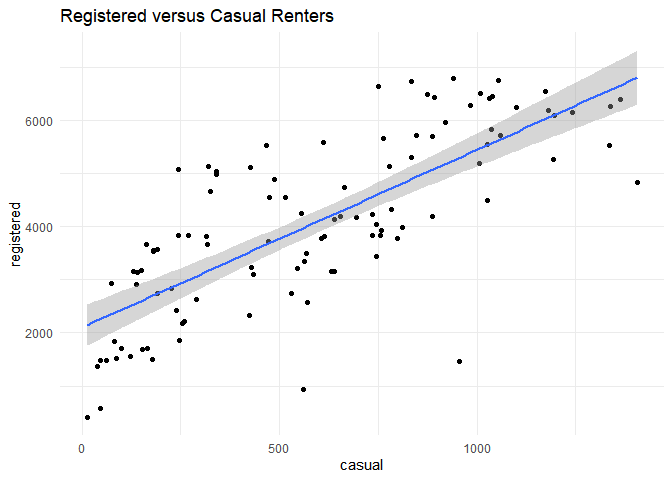
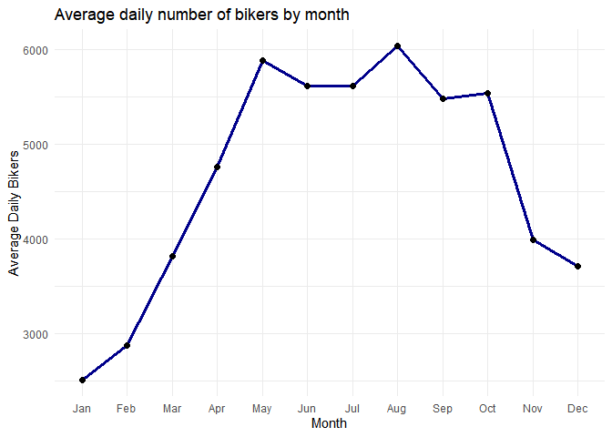
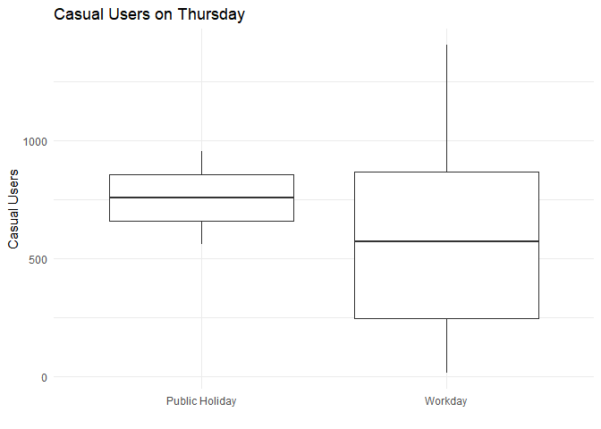
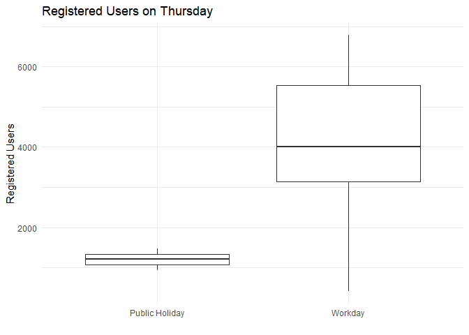
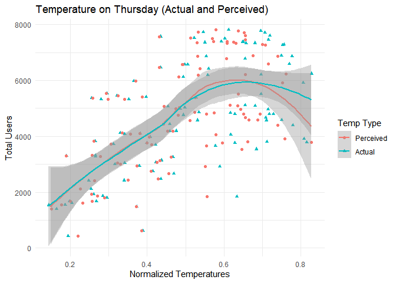
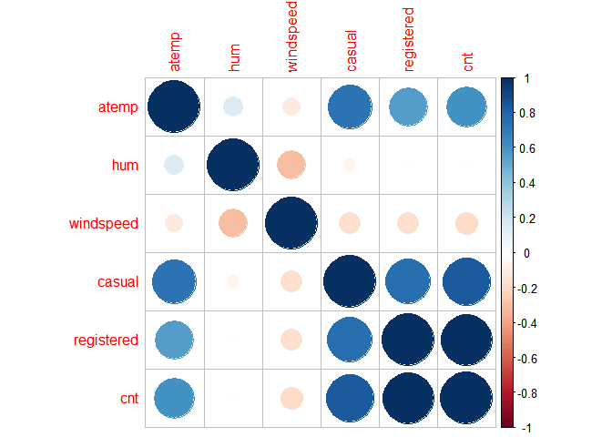
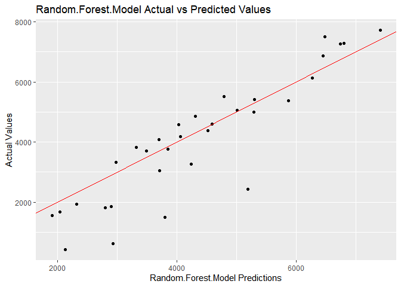

ST558 Project 2
================
Crista Gregg and Halid Kopanski
7/2/2021

-   [Introduction](#introduction)
-   [Data](#data)
-   [Summarizations](#summarizations)
    -   [Summary statistics of users](#summary-statistics-of-users)
    -   [Rentals by Year](#rentals-by-year)
    -   [Types of weather by season](#types-of-weather-by-season)
    -   [Rentals by Weather](#rentals-by-weather)
    -   [Casual vs. Registered bikers](#casual-vs-registered-bikers)
    -   [Average bikers by month](#average-bikers-by-month)
    -   [Holiday and Temperature / Humidity
        data](#holiday-and-temperature--humidity-data)
    -   [Correlation among numeric
        predictors](#correlation-among-numeric-predictors)
-   [Modeling](#modeling)
    -   [Linear Regression](#linear-regression)
        -   [Linear Fit 1](#linear-fit-1)
        -   [Linear Fit 2](#linear-fit-2)
    -   [Ensemble Tree](#ensemble-tree)
        -   [Random Forests](#random-forests)
        -   [Boosting Model](#boosting-model)
-   [Comparison](#comparison)

# Introduction

The following analysis breaks down bicycle sharing usage based on data
gathered for every recorded Thursday in the years 2011 and 2012. The
data was gathered from users of Capitol Bikeshare based in Washington
DC. In total, the dataset contains 731 entries. For each entry, 16
variables were recorded. The following is the list of the 16 variables
and a short description of each:

| Variable   |                                                    Description                                                    |
|------------|:-----------------------------------------------------------------------------------------------------------------:|
| instant    |                                                   record index                                                    |
| dteday     |                                                       date                                                        |
| season     |                                       season (winter, spring, summer, fall)                                       |
| yr         |                                                 year (2011, 2012)                                                 |
| mnth       |                                                 month of the year                                                 |
| holiday    |                                    whether that day is holiday (1) or not (0)                                     |
| weekday    |                                                  day of the week                                                  |
| workingday |                       if day is neither a weekend nor a holiday value is 1, otherwise is 0.                       |
| weathersit |                                   Description of weather conditions (see below)                                   |
| \-         |                                1: Clear, Few clouds, Partly cloudy, Partly cloudy                                 |
| \-         |                          2: Mist + Cloudy, Mist + Broken clouds, Mist + Few clouds, Mist                          |
| \-         |            3: Light Snow, Light Rain + Thunderstorm + Scattered clouds, Light Rain + Scattered clouds             |
| \-         |                           4: Heavy Rain + Ice Pallets + Thunderstorm + Mist, Snow + Fog                           |
| temp       |                                        Normalized temperature in Celsius.                                         |
| atemp      |                                   Normalized perceived temperature in Celsius.                                    |
| hum        |                                               Normalized humidity.                                                |
| windspeed  |                                              Normalized wind speed.                                               |
| casual     |                                               count of casual users                                               |
| registered |                                             count of registered users                                             |
| cnt        |                                      sum of both casual and registered users                                      |
| *Sources*  | *Raw data and more information can be found [here](https://archive.ics.uci.edu/ml/datasets/Bike+Sharing+Dataset)* |

In addition to summary statistics, this report will also model bicycle
users by linear regression, random forests, and boosting. The model will
help determine anticipated number of users based on readily available
data. To achieve this, the response variables are casual, registered,
and cnt. The other variables, not including the date and instant
columns, will be the predictors for models developed later in this
report.

# Data

Here, we set up the data for the selected day of week and convert
categorical variables to factors, and then split the data into a train
and test set.

``` r
set.seed(1) #get the same splits every time
bikes <- read_csv('day.csv')

day_function <- function(x){
  x <- x + 1
  switch(x,"Sunday", 
           "Monday", 
           "Tuesday", 
           "Wednesday", 
           "Thursday", 
           "Friday", 
           "Saturday")
}

season_function <- function(x){
    #x <- as.character(x)
    switch(x, "Spring",
              "Summer",
              "Fall",
              "Winter")
}

bikes <- bikes %>% select(everything()) %>% 
  mutate(weekday = sapply(weekday, day_function), 
         season = sapply(season, season_function)) 
  

bikes$season <- as.factor(bikes$season)
bikes$yr <- as.factor(bikes$yr)
levels(bikes$yr) <- c('2011','2012')
bikes$mnth <- as.factor(bikes$mnth)
bikes$holiday <- as.factor(bikes$holiday)
bikes$weekday <- as.factor(bikes$weekday)
bikes$workingday <- as.factor(bikes$workingday)
bikes$weathersit <- as.factor(bikes$weathersit)

day <- params$day_of_week

#filter bikes by day of week
bikes <- filter(bikes, weekday == day)

#split data into train and test sets
train_rows <- sample(nrow(bikes), 0.7*nrow(bikes))
train <- bikes[train_rows,] %>% 
  select(-instant, -weekday, -casual, -registered)
test <- bikes[-train_rows,] %>% 
  select(-instant, -weekday, -casual, -registered)
```

# Summarizations

## Summary statistics of users

Below shows the summary statistics of bike users: casual, registered,
and total.

``` r
knitr::kable(summary(bikes[,14:16]))
```

|     | casual         | registered   | cnt          |
|:----|:---------------|:-------------|:-------------|
|     | Min. : 15.0    | Min. : 416   | Min. : 431   |
|     | 1st Qu.: 246.2 | 1st Qu.:3063 | 1st Qu.:3271 |
|     | Median : 570.0 | Median :3950 | Median :4721 |
|     | Mean : 591.0   | Mean :4076   | Mean :4667   |
|     | 3rd Qu.: 878.2 | 3rd Qu.:5524 | 3rd Qu.:6286 |
|     | Max. :1405.0   | Max. :6781   | Max. :7804   |

## Rentals by Year

The following table tells us the total number of rentals for each of the
two years of collected data, as well as the average number of rentals
per day.

``` r
bikes %>%
  group_by(yr) %>%
  summarise(total_rentals = sum(cnt), avg_rentals = round(mean(cnt))) %>%
  knitr::kable()
```

| yr   | total\_rentals | avg\_rentals |
|:-----|---------------:|-------------:|
| 2011 |         174552 |         3357 |
| 2012 |         310843 |         5978 |

## Types of weather by season

Now we will look at the number of days with each type of weather by
season. 1 represents ‘Clear to some clouds’, 2 represents ‘Misty’, and 3
represents ‘Light snow or rain’.

``` r
knitr::kable(table(bikes$season, bikes$weathersit))
```

|        |   1 |   2 |   3 |
|:-------|----:|----:|----:|
| Fall   |  20 |   7 |   1 |
| Spring |  16 |   8 |   1 |
| Summer |  18 |   7 |   1 |
| Winter |  13 |  12 |   0 |

## Rentals by Weather

The following box plot shows us how many rentals we have for days that
are sunny or partly cloudy, misty, or rainy/snowy. We may expect some
differences in behavior between weekend days where less people might be
inclined to ride their bikes for pleasure, versus weekdays when more
people might brave moderately unpleasant weather to get to work.

``` r
ggplot(bikes, aes(factor(weathersit), cnt)) +
  geom_boxplot() +
  labs(x = 'Type of Weather', y = 'Number of Rental Bikes', title = 'Rental Bikes by Type of Weather') +
  scale_x_discrete(labels = c('Clear to some clouds', 'Misty', 'Light snow or rain')) +
  theme_minimal()
```

<!-- -->

``` r
weather_summary <- 
  bikes %>%
  group_by(weathersit) %>%
  summarise(total_rentals = sum(cnt), avg_rentals = round(mean(cnt)))

weather_min <- switch(which.min(weather_summary$avg_rentals),
                               "clear weather",
                                                             "misty weather",
                                                             "weather with light snow or rain")
```

According to the above box plot, it can be seen that weather with light
snow or rain brings out the least amount of total users.

## Casual vs. Registered bikers

Below is a chart of the relationship between casual and registered
bikers. We might expect a change in the slope if we look at different
days of the week. Perhaps we see more registered bikers riding on the
weekday but more casual users on the weekend.

``` r
ggplot(bikes, aes(casual, registered)) +
  geom_point() +
  geom_smooth(formula = 'y ~ x', method = 'lm') +
  theme_minimal() +
  labs(title = 'Registered versus Casual Renters')
```

<!-- -->

## Average bikers by month

Below we see a plot of the average daily number of bikers by month. We
should expect to see more bikers in the spring and summer months, and
the least in the winter.

``` r
plot_mth <- bikes %>%
  group_by(mnth) %>%
  summarize(avg_bikers = mean(cnt))

ggplot(plot_mth, aes(mnth, avg_bikers)) +
  geom_line(group = 1, color = 'darkblue', size = 1.2) +
  geom_point(size = 2) +
  theme_minimal() +
  labs(title='Average daily number of bikers by month', y = 'Average Daily Bikers', x = 'Month') +
  scale_x_discrete(labels = month.abb)
```

<!-- -->

``` r
month_max <- month.name[which.max(plot_mth$avg_bikers)]
month_min <- month.name[which.min(plot_mth$avg_bikers)]

user_max <- max(plot_mth$avg_bikers)
user_min <- min(plot_mth$avg_bikers)

changes <- rep(0, 11)
diff_mth <- rep("x", 11)

for (i in 2:12){
  diff_mth[i - 1] <- paste(month.name[i - 1], "to", month.name[i])
  changes[i - 1] <- round(plot_mth$avg_bikers[i] - plot_mth$avg_bikers[i - 1])
}


diff_tab_mth <- as_tibble(cbind(diff_mth, changes))
```

According to the graph, August has the highest number of users with a
value of 6038. The month with the lowest number of users is January with
an average of 2513.

The largest decrease in month to month users was October to November
with an average change of -1543.

The largest increase in month to month users was April to May with an
average change of 1129.

## Holiday and Temperature / Humidity data

We would like to see what effect public holidays have on the types of
bicycle users on average for a given day. In this case, Thursday data
shows the following relationships:

``` r
bikes %>% ggplot(aes(x = as.factor(workingday), y = casual)) + geom_boxplot() + 
                labs(title = paste("Casual Users on", params$day_of_week)) + 
                xlab("") + 
                ylab("Casual Users") + 
                scale_x_discrete(labels = c('Public Holiday', 'Workday')) + 
                theme_minimal()
```

<!-- -->

``` r
bikes %>% ggplot(aes(x = as.factor(workingday), y = registered)) + geom_boxplot() + 
                labs(title = paste("Registered Users on", params$day_of_week)) + 
                xlab("") + 
                ylab("Registered Users") +
                scale_x_discrete(labels = c('Public Holiday', 'Workday')) +
                theme_minimal()
```

<!-- -->

Temperature and humidity have an effect on the number of users on a
given day.

First, normalized temperature data (both actual temperature and
perceived):

``` r
bike_temp <- bikes %>% select(cnt, temp, atemp) %>% 
                    gather(key = type, value = temp_norm, temp, atemp, factor_key = FALSE)

ggplot(bike_temp, aes(x = temp_norm, y = cnt, col = type, shape = type)) + 
        geom_point() + geom_smooth(formula = 'y ~ x', method = 'loess') +
        scale_color_discrete(name = "Temp Type", labels = c("Perceived", "Actual")) +
        scale_shape_discrete(name = "Temp Type", labels = c("Perceived", "Actual")) +
        labs(title = paste("Temperature on", params$day_of_week, "(Actual and Perceived)")) +
        xlab("Normalized Temperatures") +
        ylab("Total Users") + 
        theme_minimal()
```

<!-- -->

Next the effect of humidity:

``` r
bikes%>% ggplot(aes(x = hum, y = cnt)) + geom_point() + geom_smooth(formula = 'y ~ x', method = 'loess') +
                labs(title = paste("Humidity versus Total Users on", params$day_of_week)) +
                xlab("Humidity (normalized)") +
                ylab("Total Number of Users") +
                theme_minimal()
```

<!-- -->

## Correlation among numeric predictors

Here we are checking the correlation between the numeric predictors in
the data.

``` r
knitr::kable(round(cor(bikes[ , c(11:16)]), 3))
```

|            |  atemp |    hum | windspeed | casual | registered |    cnt |
|:-----------|-------:|-------:|----------:|-------:|-----------:|-------:|
| atemp      |  1.000 |  0.149 |    -0.119 |  0.733 |      0.553 |  0.609 |
| hum        |  0.149 |  1.000 |    -0.310 | -0.057 |      0.007 | -0.005 |
| windspeed  | -0.119 | -0.310 |     1.000 | -0.172 |     -0.177 | -0.183 |
| casual     |  0.733 | -0.057 |    -0.172 |  1.000 |      0.757 |  0.833 |
| registered |  0.553 |  0.007 |    -0.177 |  0.757 |      1.000 |  0.992 |
| cnt        |  0.609 | -0.005 |    -0.183 |  0.833 |      0.992 |  1.000 |

``` r
corrplot(cor(bikes[ , c(11:16)]), method = "circle")
```

<!-- -->

# Modeling

Now, we will fit two linear regression model, a random forest model, and
a boosting model. We will use cross-validation to select the best tuning
parameters for the ensemble based methods, and then compare all four
models using the test MSE.

## Linear Regression

Linear regression is one of the most common methods for modeling. It
looks at a set of predictors and estimates what will happen to the
response if one of the predictors or a combination of predictors change.
This model is highly interpretable, as it shows us the effect of each
individual predictor as well as interactions. We can see if the change
in the response goes up or down and in what quantity. The model is
chosen by minimizing the squares of the distances between the estimated
value and the actual value in the testing set. Below we fit two
different linear regression models.

### Linear Fit 1

The first model will have a subset of predictors chosen by stepwise
selection. Once we have chosen an interesting set of predictors, we will
use cross-validation to determine the RMSE and R<sup>2</sup>.

``` r
set.seed(10)
lm.fit <- train(cnt ~ season + yr + weathersit + atemp + hum + windspeed, data = train[, 2:12], method = 'lm',
                preProcess = c('center', 'scale'),
                trControl = trainControl(method = 'cv', number = 10))
lm.fit
```

    ## Linear Regression 
    ## 
    ## 72 samples
    ##  6 predictor
    ## 
    ## Pre-processing: centered (9), scaled (9) 
    ## Resampling: Cross-Validated (10 fold) 
    ## Summary of sample sizes: 64, 64, 65, 64, 65, 66, ... 
    ## Resampling results:
    ## 
    ##   RMSE      Rsquared   MAE     
    ##   734.6588  0.8446995  636.8947
    ## 
    ## Tuning parameter 'intercept' was held constant at a value of TRUE

Our first linear model has an RMSE of 734.66.

### Linear Fit 2

Using transformations of predictors identified in the first linear fit.

``` r
set.seed(10)
lm.fit1 <- train(cnt ~ season + yr + weathersit + poly(hum, 3) + I(atemp^0.5) + windspeed, data = train[, 2:12], method = 'lm',
                preProcess = c('center', 'scale'),
                trControl = trainControl(method = 'cv', number = 10))
lm.fit1
```

    ## Linear Regression 
    ## 
    ## 72 samples
    ##  6 predictor
    ## 
    ## Pre-processing: centered (11), scaled (11) 
    ## Resampling: Cross-Validated (10 fold) 
    ## Summary of sample sizes: 64, 64, 65, 64, 65, 66, ... 
    ## Resampling results:
    ## 
    ##   RMSE      Rsquared   MAE     
    ##   763.7467  0.8397823  653.2964
    ## 
    ## Tuning parameter 'intercept' was held constant at a value of TRUE

The RMSE value of the model changed to 763.75.

## Ensemble Tree

Ensemble trees methods come in many types and are very versatile when it
comes to regression or classification. For the following, we will be
using the two most common and well known methods: Random Forests (a form
of bagging) and Boosting. Both these tree based methods involve
optimization during the development process. In the case of random
forests, the optimization involves varying the number of predictors
used. This is done to mitigate the effects of one or more predictors
from overshadowing other predictors. Boosting is a method where the
final model is developed through an iterative combination of weaker
models where each iteration builds upon the last. While both methods are
very flexible and tend to process good results, the models themselves
are not as interpretable as linear regression. We normally just analyze
the output of the models.

### Random Forests

Below is the result of training with the random forest method. This
method uses a different subset of predictors for each tree and averages
the results across many trees, selected by bootstrapping. By reducing
the number of predictors considered in each tree, we may be able to
reduce the correlation between trees to improve our results. In the
training model below, we vary the number of predictors used in each
tree.

``` r
rf_fit <- train(cnt ~ ., data = train[, 2:12], method = 'rf',
                preProcess = c('center', 'scale'),
                tuneGrid = data.frame(mtry = 1:10))
rf_fit
```

    ## Random Forest 
    ## 
    ## 72 samples
    ## 10 predictors
    ## 
    ## Pre-processing: centered (23), scaled (23) 
    ## Resampling: Bootstrapped (25 reps) 
    ## Summary of sample sizes: 72, 72, 72, 72, 72, 72, ... 
    ## Resampling results across tuning parameters:
    ## 
    ##   mtry  RMSE       Rsquared   MAE      
    ##    1    1536.5087  0.6236545  1321.5472
    ##    2    1225.5796  0.7228303  1046.2283
    ##    3    1065.7195  0.7753845   898.6175
    ##    4     960.5088  0.8127159   799.8696
    ##    5     901.4282  0.8277360   744.6310
    ##    6     860.5639  0.8352925   707.8102
    ##    7     835.0243  0.8374360   687.9077
    ##    8     817.0103  0.8391227   676.8263
    ##    9     807.0021  0.8388095   670.6317
    ##   10     798.3287  0.8369205   664.9287
    ## 
    ## RMSE was used to select the optimal model using the smallest value.
    ## The final value used for the model was mtry = 10.

The best model uses 10 predictors. This gives an RMSE of 798.33.

### Boosting Model

The following are the results of Boosting model development using the
provided bike data.

``` r
trctrl <- trainControl(method = "repeatedcv", 
                       number = 10, 
                       repeats = 3)

set.seed(2020)

boost_grid <- expand.grid(n.trees = c(20, 100, 500),
                          interaction.depth = c(1, 3, 5),
                          shrinkage = c(0.1, 0.01, 0.001),
                          n.minobsinnode = 10)

boost_fit <-  train(cnt ~ ., 
                    data = select(train, cnt, hum, temp, atemp, windspeed, workingday, season, weathersit, yr), 
                    method = "gbm", 
                    verbose = F, #suppresses excessive printing while model is training
                    trControl = trctrl, 
                    tuneGrid = data.frame(boost_grid))
```

A total of 27 models were evaluated. Each differing by the combination
of boosting parameters. The results are show below:

``` r
print(boost_fit)
```

    ## Stochastic Gradient Boosting 
    ## 
    ## 72 samples
    ##  8 predictor
    ## 
    ## No pre-processing
    ## Resampling: Cross-Validated (10 fold, repeated 3 times) 
    ## Summary of sample sizes: 66, 64, 64, 64, 64, 64, ... 
    ## Resampling results across tuning parameters:
    ## 
    ##   shrinkage  interaction.depth  n.trees  RMSE       Rsquared   MAE      
    ##   0.001      1                   20      1803.7727  0.6192964  1534.6698
    ##   0.001      1                  100      1742.8711  0.6346525  1473.6384
    ##   0.001      1                  500      1508.6334  0.7106600  1268.8846
    ##   0.001      3                   20      1802.9551  0.6223451  1534.1533
    ##   0.001      3                  100      1739.4533  0.6448948  1470.6783
    ##   0.001      3                  500      1483.5103  0.7215642  1247.9871
    ##   0.001      5                   20      1803.0211  0.6302004  1534.0942
    ##   0.001      5                  100      1739.3401  0.6432298  1470.6524
    ##   0.001      5                  500      1484.1487  0.7167768  1248.0569
    ##   0.010      1                   20      1674.8002  0.6618092  1410.3764
    ##   0.010      1                  100      1308.5856  0.7447496  1098.2456
    ##   0.010      1                  500       890.3080  0.8099743   749.0178
    ##   0.010      3                   20      1664.0521  0.6612188  1403.4356
    ##   0.010      3                  100      1253.9133  0.7654264  1051.7556
    ##   0.010      3                  500       846.6581  0.8229915   706.1512
    ##   0.010      5                   20      1669.1199  0.6666112  1407.5024
    ##   0.010      5                  100      1247.1704  0.7716133  1046.4042
    ##   0.010      5                  500       848.7096  0.8231202   709.2721
    ##   0.100      1                   20      1079.9195  0.7586377   903.0052
    ##   0.100      1                  100       851.1249  0.8240164   687.4616
    ##   0.100      1                  500       825.6938  0.8306110   664.1847
    ##   0.100      3                   20      1029.5161  0.7643701   875.5980
    ##   0.100      3                  100       833.0054  0.8207254   676.7827
    ##   0.100      3                  500       819.9987  0.8300591   662.4598
    ##   0.100      5                   20      1017.9158  0.7796758   867.1908
    ##   0.100      5                  100       807.5492  0.8360027   653.5271
    ##   0.100      5                  500       788.7523  0.8447483   634.1528
    ## 
    ## Tuning parameter 'n.minobsinnode' was held constant at a value of 10
    ## RMSE was used to select the optimal model using the smallest value.
    ## The final values used for the model were n.trees = 500, interaction.depth = 5, shrinkage = 0.1 and n.minobsinnode = 10.

``` r
results_tab <- as_tibble(boost_fit$results[,c(1,2,4:6)])
```

The attributes of the best model is shown here.

``` r
boost_min <- which.min(results_tab$RMSE)

knitr::kable(results_tab[boost_min,], digits = 2)
```

| shrinkage | interaction.depth | n.trees |   RMSE | Rsquared |
|----------:|------------------:|--------:|-------:|---------:|
|       0.1 |                 5 |     500 | 788.75 |     0.84 |

# Comparison

Here we compare the 4 models developed earlier. Each model was applied
to a test set and the results were then used to calculate MSE. Below are
the results.

``` r
lm_pred <- predict(lm.fit, newdata = test)
lm_pred1 <- predict(lm.fit1, newdata = test)
rf_pred <- predict(rf_fit, newdata = test)
boost_pred <- predict(boost_fit, newdata = test)

prediction_values <- as_tibble(cbind(lm_pred, lm_pred1, rf_pred, boost_pred))

lm_MSE <- mean((lm_pred - test$cnt)^2)
lm_MSE1 <- mean((lm_pred1 - test$cnt)^2)
rf_MSE <- mean((rf_pred - test$cnt)^2)
boost_MSE <- mean((boost_pred - test$cnt)^2)

comp <- data.frame('Linear Model 1' = lm_MSE, 
                   'Linear Model 2' = lm_MSE1, 
                   'Random Forest Model' = rf_MSE, 
                   'Boosting Model' = boost_MSE)

knitr::kable(t(comp), col.names = "MSE")
```

|                     |       MSE |
|:--------------------|----------:|
| Linear.Model.1      | 1101089.2 |
| Linear.Model.2      | 1050534.8 |
| Random.Forest.Model |  906920.8 |
| Boosting.Model      |  999711.1 |

It was found that Random.Forest.Model achieves the lowest test MSE of
9.0692082^{5} for Thursday data.

Below is a graph of the Actual vs Predicted results:

``` r
index_val <- (which.min(t(comp)))

results_plot <- as_tibble(cbind("preds" = prediction_values[[index_val]], "actual" = test$cnt))

ggplot(data = results_plot, aes(preds, actual)) + geom_point() +
     labs(x = paste(names(which.min(comp)), "Predictions"), y = "Actual Values",
     title = paste(names(which.min(comp)), "Actual vs Predicted Values")) +
     geom_abline(slope = 1, intercept = 0, col = 'red')
```

<!-- -->
