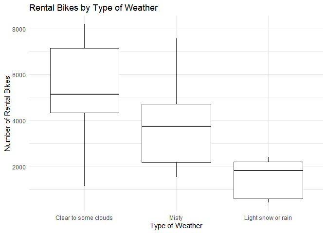
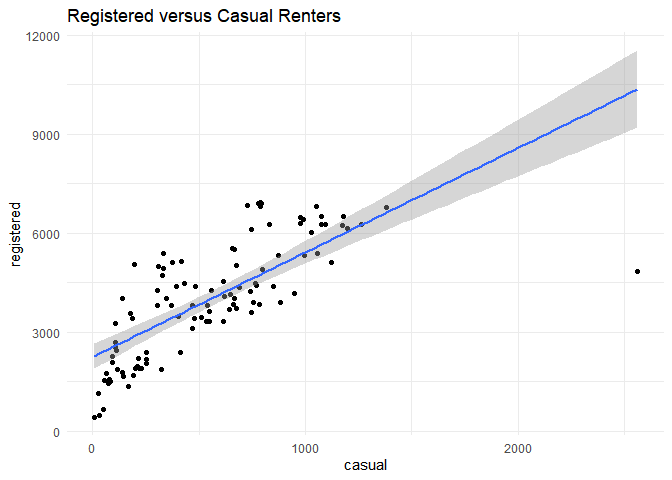
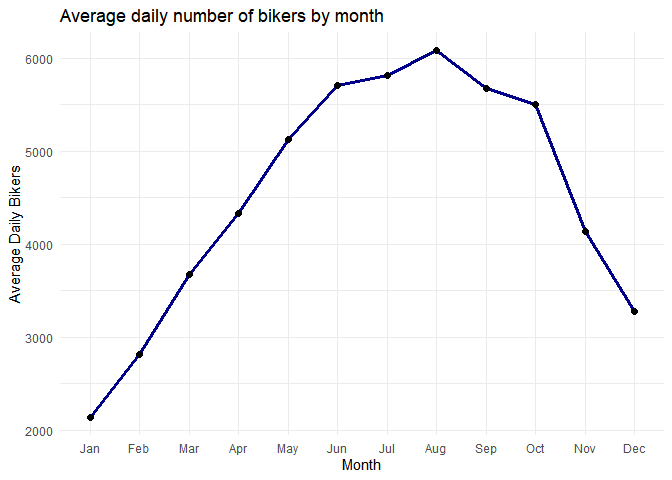
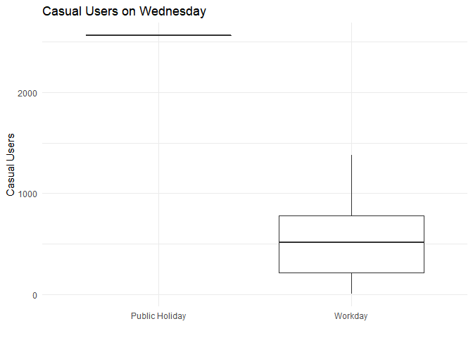
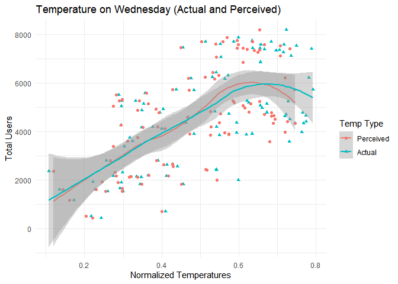
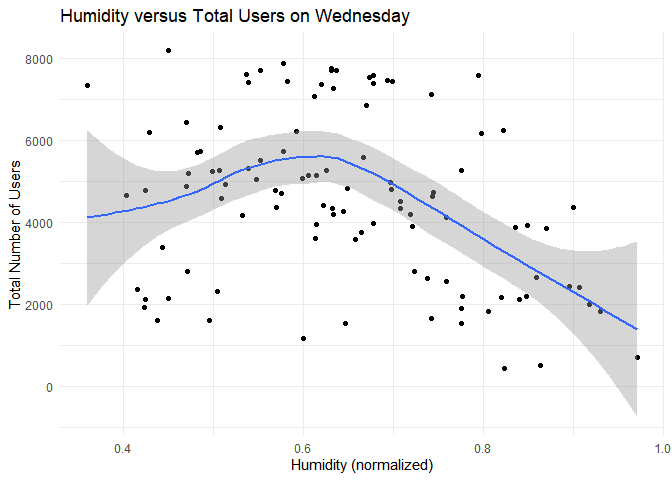

ST558 Project 2
================
Crista Gregg and Halid Kopanski
7/2/2021

-   [Introduction](#introduction)
-   [Data](#data)
-   [Summarizations](#summarizations)
    -   [Summary statistics of users](#summary-statistics-of-users)
    -   [Rentals by Year](#rentals-by-year)
    -   [Types of weather by season](#types-of-weather-by-season)
    -   [Rentals by Weather](#rentals-by-weather)
    -   [Casual vs. Registered bikers](#casual-vs-registered-bikers)
    -   [Average bikers by month](#average-bikers-by-month)
    -   [Holiday and Temp/Hum data](#holiday-and-temphum-data)
    -   [Correlation among numeric
        predictors](#correlation-among-numeric-predictors)
-   [Modeling](#modeling)
    -   [Linear Regression](#linear-regression)
        -   [Linear Fit 1](#linear-fit-1)
        -   [Linear Fit 2](#linear-fit-2)
    -   [Ensemble Tree](#ensemble-tree)
        -   [Random Forests](#random-forests)
        -   [Boosting Model](#boosting-model)
-   [Comparison](#comparison)

# Introduction

The following analysis breaks down bicycle sharing usage based on data
gathered for every recorded Wednesday in the years 2011 and 2012. The
data was gathered from users of Capitol Bikeshare based in Washington
DC. In total, the dataset contains 731 entries. For each entry, 16
variables were recorded. The following is the list of the 16 variables
and a short description of each:

| Variable   |                                                    Description                                                    |
|------------|:-----------------------------------------------------------------------------------------------------------------:|
| instant    |                                                   record index                                                    |
| dteday     |                                                       date                                                        |
| season     |                                       season (winter, spring, summer, fall)                                       |
| yr         |                                                 year (2011, 2012)                                                 |
| mnth       |                                                 month of the year                                                 |
| holiday    |                            whether day is holiday or not (extracted from \[Web Link\])                            |
| weekday    |                                                  day of the week                                                  |
| workingday |                            if day is neither weekend nor holiday is 1, otherwise is 0.                            |
| weathersit |                                                                                                                   |
| \-         |                                1: Clear, Few clouds, Partly cloudy, Partly cloudy                                 |
| \-         |                          2: Mist + Cloudy, Mist + Broken clouds, Mist + Few clouds, Mist                          |
| \-         |            3: Light Snow, Light Rain + Thunderstorm + Scattered clouds, Light Rain + Scattered clouds             |
| \-         |                           4: Heavy Rain + Ice Pallets + Thunderstorm + Mist, Snow + Fog                           |
| temp       |                                        Normalized temperature in Celsius.                                         |
| atemp      |                                   Normalized perceived temperature in Celsius.                                    |
| hum        |                                               Normalized humidity.                                                |
| windspeed  |                                              Normalized wind speed.                                               |
| casual     |                                               count of casual users                                               |
| registered |                                             count of registered users                                             |
| cnt        |                                      sum of both casual and registered users                                      |
| *Sources*  | *Raw data and more information can be found [here](https://archive.ics.uci.edu/ml/datasets/Bike+Sharing+Dataset)* |

In addition to summary statistics, this report will also model bicycle
users by linear regression, random forests, and boosting. The model will
help determine anticipated number of users based on readily available
data. To achieve this, the response variables are casual, registered,
and cnt. The other variables, not including the date and instant
columns, will be the predictors for models developed later in this
report.

# Data

Here, we set up the data for the selected day of week and convert
categorical variables to factors, and then split the data into a train
and test set.

``` r
set.seed(1) #get the same splits every time
bikes <- read_csv('day.csv')

day_function <- function(x){
  x <- as.character(x)
  switch(x, "0" = "Sunday", 
         "1" = "Monday", 
         "2" = "Tuesday", 
         "3" = "Wednesday", 
         "4" = "Thursday", 
         "5" = "Friday", 
         "6" = "Saturday")
}

season_function <- function(x){
    x <- as.character(x)
    switch(x, "1" = "Spring",
              "2" = "Summer",
              "3" = "Fall",
              "4" = "Winter")
}

bikes <- bikes %>% select(everything()) %>% 
  mutate(weekday = sapply(weekday, day_function), 
         season = sapply(season, season_function)) 
  

bikes$season <- as.factor(bikes$season)
bikes$yr <- as.factor(bikes$yr)
levels(bikes$yr) <- c('2019','2020')
bikes$mnth <- as.factor(bikes$mnth)
bikes$holiday <- as.factor(bikes$holiday)
bikes$weekday <- as.factor(bikes$weekday)
bikes$workingday <- as.factor(bikes$workingday)
bikes$weathersit <- as.factor(bikes$weathersit)

day <- params$day_of_week

#filter bikes by day of week
bikes <- filter(bikes, weekday == day)

#split data into train and test sets
train_rows <- sample(nrow(bikes), 0.7*nrow(bikes))
train <- bikes[train_rows,] %>% 
  select(-instant, -weekday, -casual, -registered)
test <- bikes[-train_rows,] %>% 
  select(-instant, -weekday, -casual, -registered)
```

# Summarizations

## Summary statistics of users

Below shows the summary statistics of bike users: casual, registered,
and total.

``` r
summary(bikes[,14:16])
```

    ##      casual         registered        cnt      
    ##  Min.   :   9.0   Min.   : 432   Min.   : 441  
    ##  1st Qu.: 215.0   1st Qu.:2439   1st Qu.:2653  
    ##  Median : 524.5   Median :4023   Median :4642  
    ##  Mean   : 551.1   Mean   :3997   Mean   :4549  
    ##  3rd Qu.: 784.8   3rd Qu.:5189   3rd Qu.:6176  
    ##  Max.   :2562.0   Max.   :6946   Max.   :8173

## Rentals by Year

The following table tells us the total number of rentals for each of the
two years of collected data, as well as the average number of rentals
per day.

``` r
bikes %>%
  group_by(yr) %>%
  summarise(total_rentals = sum(cnt), avg_rentals = round(mean(cnt))) %>%
  knitr::kable()
```

| yr   | total\_rentals | avg\_rentals |
|:-----|---------------:|-------------:|
| 2019 |         169169 |         3253 |
| 2020 |         303879 |         5844 |

## Types of weather by season

Now we will look at the number of days with each type of weather by
season. 1 represents ‘Clear to some clouds’, 2 represents ‘Misty’, and 3
represents ‘Light snow or rain’.

``` r
table(bikes$season, bikes$weathersit)
```

    ##         
    ##           1  2  3
    ##   Fall   23  3  1
    ##   Spring 13 10  2
    ##   Summer 15 12  0
    ##   Winter 13  8  4

## Rentals by Weather

The following box plot shows us how many rentals we have for days that
are sunny or partly cloudy, misty, or rainy/snowy. We may expect some
differences in behavior between weekend days where less people might be
inclined to ride their bikes for pleasure, versus weekdays when more
people might brave moderately unpleasant weather to get to work.

``` r
ggplot(bikes, aes(factor(weathersit), cnt)) +
  geom_boxplot() +
  labs(x = 'Type of Weather', y = 'Number of Rental Bikes', title = 'Rental Bikes by Type of Weather') +
  scale_x_discrete(labels = c('Clear to some clouds', 'Misty', 'Light snow or rain')) +
  theme_minimal()
```

<!-- -->

## Casual vs. Registered bikers

Below is a chart of the relationship between casual and registered
bikers. We might expect a change in the slope if we look at different
days of the week. Perhaps we see more registered bikers riding on the
weekday but more casual users on the weekend.

``` r
ggplot(bikes, aes(casual, registered)) +
  geom_point() +
  geom_smooth(method = 'lm') +
  theme_minimal() +
  labs(title = 'Registered versus Casual Renters')
```

    ## `geom_smooth()` using formula 'y ~ x'

<!-- -->

## Average bikers by month

Below we see a plot of the average daily number of bikers by month. We
should expect to see more bikers in the spring and summer months, and
the least in the winter.

``` r
plot_mth <- bikes %>%
  group_by(mnth) %>%
  summarize(avg_bikers = mean(cnt))

ggplot(plot_mth, aes(mnth, avg_bikers)) +
  geom_line(group = 1, color = 'darkblue', size = 1.2) +
  geom_point(size = 2) +
  theme_minimal() +
  labs(title='Average daily number of bikers by month', y = 'Average Daily Bikers', x = 'Month') +
  scale_x_discrete(labels = month.abb)
```

<!-- -->

## Holiday and Temp/Hum data

We would like to see what effect public holidays have on the types of
bicycle users for a given day. In this case, Wednesday show the
following relationships:

``` r
bikes %>% ggplot(aes(x = as.factor(workingday), y = casual)) + geom_boxplot() + 
                labs(title = paste("Casual Users on", params$day_of_week)) + 
                xlab("") + 
                ylab("Casual Users") + 
                scale_x_discrete(labels = c('Public Holiday', 'Workday')) + 
                theme_minimal()
```

<!-- -->

``` r
bikes %>% ggplot(aes(x = as.factor(workingday), y = registered)) + geom_boxplot() + 
                labs(title = paste("Registered Users on", params$day_of_week)) + 
                xlab("") + 
                ylab("Registered Users") +
                scale_x_discrete(labels = c('Public Holiday', 'Workday')) +
                theme_minimal()
```

<!-- -->

Temperature and humidity have an effect on the number of users on a
given day.

First, normalized temperature data (both actual temperature and
perceived):

``` r
bike_temp <- bikes %>% select(cnt, temp, atemp) %>% 
                    gather(key = type, value = temp_norm, temp, atemp, factor_key = FALSE)

ggplot(bike_temp, aes(x = temp_norm, y = cnt, col = type, shape = type)) + 
        geom_point() + geom_smooth(formula = 'y ~ x', method = 'loess') +
        scale_color_discrete(name = "Temp Type", labels = c("Perceived", "Actual")) +
        scale_shape_discrete(name = "Temp Type", labels = c("Perceived", "Actual")) +
        labs(title = paste("Temperature on", params$day_of_week, "(Actual and Perceived)")) +
        xlab("Normalized Temperatures") +
        ylab("Total Users") + 
        theme_minimal()
```

<!-- -->

Next the affect of humidity:

``` r
bikes%>% ggplot(aes(x = hum, y = cnt)) + geom_point() + geom_smooth(formula = 'y ~ x', method = 'loess') +
                labs(title = paste("Humidity versus Total Users on", params$day_of_week)) +
                xlab("Humidity (normalized)") +
                ylab("Total Number of Users") +
                theme_minimal()
```

<!-- -->

## Correlation among numeric predictors

Here we are checking the correlation between the numeric predictors in
the data.

``` r
knitr::kable(round(cor(bikes[ , c(11:16)]), 3))
```

|            |  atemp |    hum | windspeed | casual | registered |    cnt |
|:-----------|-------:|-------:|----------:|-------:|-----------:|-------:|
| atemp      |  1.000 |  0.036 |    -0.350 |  0.743 |      0.566 |  0.625 |
| hum        |  0.036 |  1.000 |    -0.143 | -0.238 |     -0.312 | -0.311 |
| windspeed  | -0.350 | -0.143 |     1.000 | -0.339 |     -0.340 | -0.355 |
| casual     |  0.743 | -0.238 |    -0.339 |  1.000 |      0.737 |  0.821 |
| registered |  0.566 | -0.312 |    -0.340 |  0.737 |      1.000 |  0.991 |
| cnt        |  0.625 | -0.311 |    -0.355 |  0.821 |      0.991 |  1.000 |

``` r
corrplot(cor(bikes[ , c(11:16)]), method = "circle")
```

<!-- -->

# Modeling

Now, we will fit two linear regression model, a random forest model, and
a boosting model. We will use cross-validation to select the best tuning
parameters for the ensemble based methods, and then compare all four
models using the test MSE.

## Linear Regression

Linear regression is one of the most common methods for modeling. It
looks at a set of predictors and estimates what will happen to the
response if one of the predictors or a combination of predictors change.
This model is highly interpretable, as it shows us the effect of each
individual predictor as well as interactions. We can see if the change
in the response goes up or down and in what quantity. The model is
chosen by minimizing the squares of the distances between the estimated
value and the actual value in the testing set. Below we fit two
different linear regression models.

### Linear Fit 1

The first model will have a subset of predictors chosen by stepwise
selection. Once we have chosen an interesting set of predictors, we will
use cross-validation to determine the RMSE and R<sup>2</sup>.

``` r
set.seed(10)
lm.fit <- train(cnt ~ season + yr + weathersit + atemp + hum + windspeed, data = train[, 2:12], method = 'lm',
                preProcess = c('center', 'scale'),
                trControl = trainControl(method = 'cv', number = 10))
lm.fit
```

    ## Linear Regression 
    ## 
    ## 72 samples
    ##  6 predictor
    ## 
    ## Pre-processing: centered (9), scaled (9) 
    ## Resampling: Cross-Validated (10 fold) 
    ## Summary of sample sizes: 64, 64, 65, 64, 65, 66, ... 
    ## Resampling results:
    ## 
    ##   RMSE      Rsquared   MAE     
    ##   702.2546  0.8875756  583.4555
    ## 
    ## Tuning parameter 'intercept' was held constant at a value of TRUE

Our first linear model has an RMSE of 702.25.

### Linear Fit 2

Using transformations of predictors identified in the first linear fit.

``` r
set.seed(10)
lm.fit1 <- train(cnt ~ season + yr + weathersit + poly(hum, 3) + I(atemp^0.5) + windspeed, data = train[, 2:12], method = 'lm',
                preProcess = c('center', 'scale'),
                trControl = trainControl(method = 'cv', number = 10))
lm.fit1
```

    ## Linear Regression 
    ## 
    ## 72 samples
    ##  6 predictor
    ## 
    ## Pre-processing: centered (11), scaled (11) 
    ## Resampling: Cross-Validated (10 fold) 
    ## Summary of sample sizes: 64, 64, 65, 64, 65, 66, ... 
    ## Resampling results:
    ## 
    ##   RMSE      Rsquared  MAE     
    ##   676.5989  0.896047  556.7719
    ## 
    ## Tuning parameter 'intercept' was held constant at a value of TRUE

The RMSE value of the model changed to 676.6.

## Ensemble Tree

Ensemble trees methods come in many types and are very versatile when it
comes to regression or classification. For the following, we will be
using the two most common and well known methods: Random Forests (a form
of bagging) and Boosting. Both these tree based methods involve
optimization during the development process. In the case of random
forests, the optimization involves varying the number of predictors
used. This is done to mitigate the effects of one or more predictors
from overshadowing other predictors. Boosting is a method where the
final model is developed through an iterative combination of weaker
models where each iteration builds upon the last. While both methods are
very flexible and tend to process good results, the models themselves
are not as interpretable as linear regression. We normally just analyze
the output of the models.

### Random Forests

Below is the result of training with the random forest method. This
method uses a different subset of predictors for each tree and averages
the results across many trees, selected by bootstrapping. By reducing
the number of predictors considered in each tree, we may be able to
reduce the correlation between trees to improve our results. In the
training model below, we vary the number of predictors used in each
tree.

``` r
rf_fit <- train(cnt ~ ., data = train[, 2:12], method = 'rf',
                preProcess = c('center', 'scale'),
                tuneGrid = data.frame(mtry = 1:10))
rf_fit
```

    ## Random Forest 
    ## 
    ## 72 samples
    ## 10 predictors
    ## 
    ## Pre-processing: centered (23), scaled (23) 
    ## Resampling: Bootstrapped (25 reps) 
    ## Summary of sample sizes: 72, 72, 72, 72, 72, 72, ... 
    ## Resampling results across tuning parameters:
    ## 
    ##   mtry  RMSE       Rsquared   MAE      
    ##    1    1546.7176  0.6722288  1294.5220
    ##    2    1224.7810  0.7561889  1032.4099
    ##    3    1073.4532  0.7993891   886.3850
    ##    4    1000.5718  0.8169416   808.2582
    ##    5     964.1795  0.8209499   768.0598
    ##    6     936.4426  0.8225707   732.6183
    ##    7     929.8223  0.8175684   721.7457
    ##    8     919.5785  0.8154408   707.6583
    ##    9     918.6257  0.8116352   700.1316
    ##   10     919.8451  0.8058019   696.8430
    ## 
    ## RMSE was used to select the optimal model using the smallest value.
    ## The final value used for the model was mtry = 9.

The best model uses 9 predictors. This gives an RMSE of 918.63.

### Boosting Model

The following are the results of Boosting model development using the
provided bike data.

``` r
trctrl <- trainControl(method = "repeatedcv", 
                       number = 10, 
                       repeats = 3)

set.seed(2020)

boost_grid <- expand.grid(n.trees = c(20, 100, 500),
                          interaction.depth = c(1, 3, 5),
                          shrinkage = c(0.1, 0.01, 0.001),
                          n.minobsinnode = 10)

boost_fit <-  train(cnt ~ ., 
                    data = select(train, cnt, hum, temp, atemp, windspeed, workingday, season, weathersit, yr), 
                    method = "gbm", 
                    verbose = F, #suppresses excessive printing while model is training
                    trControl = trctrl, 
                    tuneGrid = data.frame(boost_grid))
```

A total of 27 models were evaluated. Each differing by the combination
of boosting parameters. The results are show below:

``` r
print(boost_fit)
```

    ## Stochastic Gradient Boosting 
    ## 
    ## 72 samples
    ##  8 predictor
    ## 
    ## No pre-processing
    ## Resampling: Cross-Validated (10 fold, repeated 3 times) 
    ## Summary of sample sizes: 66, 64, 64, 64, 64, 64, ... 
    ## Resampling results across tuning parameters:
    ## 
    ##   shrinkage  interaction.depth  n.trees  RMSE       Rsquared   MAE      
    ##   0.001      1                   20      1928.0884  0.6461986  1591.3168
    ##   0.001      1                  100      1875.5782  0.6742613  1546.7211
    ##   0.001      1                  500      1649.5842  0.7095776  1353.0245
    ##   0.001      3                   20      1926.8410  0.6795917  1589.9240
    ##   0.001      3                  100      1869.5571  0.6866741  1540.6004
    ##   0.001      3                  500      1620.8642  0.7289050  1327.3864
    ##   0.001      5                   20      1926.7055  0.6909517  1589.9379
    ##   0.001      5                  100      1870.5497  0.6792654  1541.9841
    ##   0.001      5                  500      1620.0939  0.7269493  1326.4371
    ##   0.010      1                   20      1814.2026  0.6646121  1495.6593
    ##   0.010      1                  100      1442.8496  0.7369226  1190.3104
    ##   0.010      1                  500       952.3102  0.8134871   782.7888
    ##   0.010      3                   20      1804.5068  0.6618542  1484.7034
    ##   0.010      3                  100      1397.7398  0.7413568  1155.8356
    ##   0.010      3                  500       907.7652  0.8260883   745.1738
    ##   0.010      5                   20      1805.5901  0.6919783  1487.5508
    ##   0.010      5                  100      1395.1525  0.7431903  1151.3668
    ##   0.010      5                  500       909.6692  0.8246284   741.6996
    ##   0.100      1                   20      1205.7679  0.7330984   990.3210
    ##   0.100      1                  100       916.4157  0.8275585   751.4048
    ##   0.100      1                  500       913.3498  0.8252185   765.0000
    ##   0.100      3                   20      1141.6392  0.7564326   947.5250
    ##   0.100      3                  100       893.9095  0.8314689   739.8530
    ##   0.100      3                  500       938.7462  0.8095231   777.3429
    ##   0.100      5                   20      1150.9016  0.7567389   963.1986
    ##   0.100      5                  100       882.7971  0.8427063   719.3649
    ##   0.100      5                  500       908.5620  0.8272784   743.6862
    ## 
    ## Tuning parameter 'n.minobsinnode' was held constant at a value of 10
    ## RMSE was used to select the optimal model using the smallest value.
    ## The final values used for the model were n.trees = 100, interaction.depth = 5, shrinkage
    ##  = 0.1 and n.minobsinnode = 10.

``` r
results_tab <- as_tibble(boost_fit$results[,c(1,2,4:6)])
```

The attributes of the best model is shown here.

``` r
boost_min <- which.min(results_tab$RMSE)

knitr::kable(results_tab[boost_min,], digits = 2)
```

| shrinkage | interaction.depth | n.trees |  RMSE | Rsquared |
|----------:|------------------:|--------:|------:|---------:|
|       0.1 |                 5 |     100 | 882.8 |     0.84 |

# Comparison

``` r
lm_pred <- predict(lm.fit, newdata = test)
lm_pred1 <- predict(lm.fit1, newdata = test)
rf_pred <- predict(rf_fit, newdata = test)
boost_pred <- predict(boost_fit, newdata = test)

lm_MSE <- mean((lm_pred - test$cnt)^2)
lm_MSE1 <- mean((lm_pred1 - test$cnt)^2)
rf_pred <- mean((rf_pred - test$cnt)^2)
boost_MSE <- mean((boost_pred - test$cnt)^2)

comp <- data.frame('Linear Model 1' = lm_MSE, 'Linear Model 2' = lm_MSE1, 'Random Forest Model' = rf_pred, 'Boosting Model' = boost_MSE)

knitr::kable(t(comp))
```

|                     |          |
|:--------------------|---------:|
| Linear.Model.1      | 470736.5 |
| Linear.Model.2      | 573559.1 |
| Random.Forest.Model | 741187.1 |
| Boosting.Model      | 656727.4 |

Linear.Model.1 achieves the lowest test MSE of 4.7073654^{5}.
